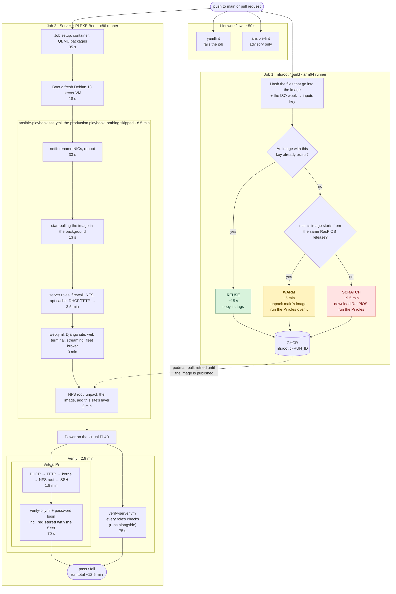

# How CI works

CI answers one question for every push and pull request: **does this
checkout deploy a working site?** To answer it, CI does three things:

1. It builds the Raspberry Pi root filesystem image from the checkout.
2. It deploys a brand-new server (a stand-in for tweed) with
   [`ansible/site.yml`](../ansible/site.yml), exactly as a real deploy does.
3. It netboots a virtual Raspberry Pi from that server, and proves that the
   Pi registered itself with the server's fleet.

Three workflows are involved:

| Workflow | File | Runs on | Typical duration | Example run |
|---|---|---|---|---|
| VM Integration Tests | [`vm-test.yml`](../.github/workflows/vm-test.yml) | every push to `main`, every PR to `main`, manual dispatch | **12½–13½ min** | [36063159932](https://github.com/fpgas-online/fpgas.online-infra/actions/runs/36063159932) (`main`, 12:26) |
| nfsroot build | [`nfsroot-build.yml`](../.github/workflows/nfsroot-build.yml) | called by the VM test; also weekly (Mondays 02:17 UTC, 11:47 Adelaide) and by manual dispatch | 15 s, ~5 min or ~9.5 min: see [§2.3](#23-why-there-are-three-ways-to-produce-it) | [35575592187](https://github.com/fpgas-online/fpgas.online-infra/actions/runs/35575592187) (weekly) |
| Lint | [`lint.yml`](../.github/workflows/lint.yml) | every push to `main` and every PR | ~50 s | [36063159621](https://github.com/fpgas-online/fpgas.online-infra/actions/runs/36063159621) |

Every duration in this document was measured on a real run, and each one
links to the run or job it came from. Anything that is an estimate says so.

---

## 1. The big picture

Every push to `main` and every pull request starts two workflows. The VM
test workflow runs **two jobs at the same time**:

- **Job 1** builds the Pi's root filesystem image.
- **Job 2** deploys a new server and boots a virtual Pi from it.

The two jobs meet at one point. Job 1 publishes the image to the GitHub
container registry (GHCR), and the server in Job 2 downloads it from
there. That handoff is the dotted arrow in the diagram.



**How to read it**

- **Job 1, the image build.** Most runs reuse an existing image (green) or
  update main's image (yellow). Both finish long before the server needs
  the image. A full from-scratch build (red) happens only when a change
  picks a new RasPiOS release, and on the weekly schedule. It is the one
  path where the server has to wait for the image.
- **Job 2, the deploy**, is `site.yml` exactly as it runs on tweed. The
  image download starts early, in the background, and only the last play
  needs the image.
- **The Pi is powered on after the server is fully deployed**, just as real
  boards are PoE-cycled after a deploy. The server's checks run while the
  Pi boots, so they add no time.

---

## 2. Job 1: the Pi root image ([`nfsroot-build.yml`](../.github/workflows/nfsroot-build.yml))

### 2.1 What the image is, and why CI builds it

Every netbooted Pi mounts the same root filesystem read-only over NFS from
the server's `/srv/nfs/rpi/bookworm`, with a tmpfs overlay for writes. That
tree holds two directories:

- `boot/` is what the Pis fetch over TFTP: the kernels, device trees and
  `config.txt`.
- `root/` is the Raspberry Pi OS userland, with the fpgas.online packages
  and settings baked in.

The server used to build this tree itself. It ran the Pi roles inside the
ARM root under `qemu-user` emulation, which took about two hours per
rebuild. Since [issue #34](https://github.com/fpgas-online/fpgas.online-infra/issues/34)
and [PR #63](https://github.com/fpgas-online/fpgas.online-infra/pull/63), a
GitHub **arm64 runner** builds it instead. The runner executes the Pi's
32-bit ARM programs natively, with no emulation; the fitness measurements
are in the spike, [PR #40](https://github.com/fpgas-online/fpgas.online-infra/pull/40).
The runner publishes the result as a container image. Servers, tweed and
the CI test server alike, just download it
([`img/tasks/pull.yml`](../ansible/roles/img/tasks/pull.yml)).

The published image is **site-agnostic**: it contains no passwords, SSH
keys or site configuration. Each server adds its own "site layer" after
downloading it, in the last play of `site.yml`
([`fixpi`](../ansible/roles/fixpi/tasks/main.yml)).

### 2.2 Where it is published: container registry tags (not git tags)

The image lives in the GitHub container registry at
[`ghcr.io/fpgas-online/nfsroot`](https://github.com/fpgas-online/fpgas.online-infra/pkgs/container/nfsroot).
It is a single-layer OCI image of about 4.0 GB uncompressed and 1.64 GB
compressed with zstd, and its filesystem holds `boot/` and `root/`. The
"tags" below are **image tags in that registry**, the name after the `:` in
`podman pull ghcr.io/fpgas-online/nfsroot:<tag>`. **Nothing is tagged in
git.**

[`tests/ci/nfsroot_publish.py`](../tests/ci/nfsroot_publish.py) (`tags()`)
gives each image several tags. These are the tags from the `main` run
[36063159932](https://github.com/fpgas-online/fpgas.online-infra/actions/runs/36063159932/job/107846650877),
which all point at the same image:

| Tag | When | Purpose | Example |
|---|---|---|---|
| `bookworm-armhf-YYYYMMDD-<sha7>` | always | pinnable identity of this build; the workflow's `image` output | `bookworm-armhf-20260924-844e8bc` ([844e8bc](https://github.com/fpgas-online/fpgas.online-infra/commit/844e8bc)) |
| `ci-<run_id>` | when the VM test calls the build | the tag the VM test pulls. Its name is known before the build starts, so the VM test can start at the same time | `ci-36063159932` |
| `bookworm-armhf` | only on `main` | rolling "latest". Production's default [`nfsroot_image`](../ansible/roles/img/defaults/main.yml), and the starting point for warm builds | `bookworm-armhf` |
| `inputs-<key>` | always, pushed **last** | fingerprint of everything that went into the image, so later runs can find it and reuse it ([§2.4](#24-how-the-path-is-chosen)) | `inputs-87b3ddc20e18c6445cba` |

Every tag must be a single image manifest
([OCI manifest](https://github.com/opencontainers/image-spec/blob/main/manifest.md)),
never an [image index](https://github.com/opencontainers/image-spec/blob/main/image-index.md).
`assert_plain_manifest()` in `nfsroot_publish.py` checks this after each
push.

The reason is architecture. The image is labelled arm64, and the servers
are amd64. `podman pull` accepts a plain manifest of any architecture, but
it refuses an index that has no amd64 entry. `docker buildx imagetools
create` produces exactly such an index, and it once broke the rolling tag.
[PR #104](https://github.com/fpgas-online/fpgas.online-infra/pull/104) fixed
that by copying tags with [skopeo](https://github.com/containers/skopeo)
`copy --preserve-digests` instead.

### 2.3 Why there are three ways to produce it

**The problem.** Building the image from nothing takes about 9½ minutes
([example job](https://github.com/fpgas-online/fpgas.online-infra/actions/runs/36052538261/job/107811379717)).
The deploy test reaches the point where it needs the image after about 7
minutes. So if every run built from scratch, every run would wait, and the
run would take about 16½ minutes instead of 12½.

**The observation.** Most pull requests don't change what goes into the
image: they touch server roles, the web tier or tests. Of those that do,
most change it a little, such as one role or one package. Only a new
RasPiOS release changes its foundation.

So the build does the least work that still gives an image that is correct
for this checkout:

| Path | Used when | What it does | Why it is safe | Time |
|---|---|---|---|---|
| **Reuse** | nothing that goes into the image changed since an earlier build (same `inputs-<key>`) | copies the existing image's tags, and builds nothing | same inputs in the same week produce the same image, so rebuilding would only burn 9½ minutes | [15 s](https://github.com/fpgas-online/fpgas.online-infra/actions/runs/36063159932/job/107846650877) |
| **Warm** | something changed, but the RasPiOS base is the same | unpacks the image `main` last published, then runs the Pi roles over it, so only the difference gets applied | the roles are idempotent Ansible. Tweed converged its live root this way for years, before the image moved to CI | [4 min 53 s](https://github.com/fpgas-online/fpgas.online-infra/actions/runs/36056167899/job/107823962630) |
| **Scratch** | the RasPiOS base changed; the weekly schedule; manual dispatch | downloads RasPiOS and runs every role on it | the only way to switch to a new base. It also proves a clean build still works | [9 min 23 s](https://github.com/fpgas-online/fpgas.online-infra/actions/runs/36052538261/job/107811379717) |

Two details keep the shortcuts honest:

- **The ISO week is part of the inputs key.** The roles install whatever
  the package repositories serve on the day. A checkout that hasn't
  changed therefore still gets a fresh (warm) build every week, which picks
  up new packages.
- **The weekly scheduled build always starts from scratch**
  ([example](https://github.com/fpgas-online/fpgas.online-infra/actions/runs/35575592187)).
  A warm image is layered on top of older ones, and can carry leftovers
  (removed files, old configuration) that a clean build would not have.
  The weekly clean build caps that drift at one week, and keeps the
  scratch path tested.

### 2.4 How the path is chosen

1. **Reuse?** The step "Reuse an image built from the same inputs" runs
   `nfsroot_publish.py --reuse`. It computes `key()` in
   [`tests/ci/nfsroot_inputs.py`](../tests/ci/nfsroot_inputs.py): a SHA-256
   of the ISO week plus the content of every git-tracked file listed in
   `INPUTS`. Those are:
   - [`ci-nfsroot.yml`](../ansible/ci-nfsroot.yml) and
     [`inventory-ci-nfsroot/`](../ansible/inventory-ci-nfsroot/);
   - the production group_vars that inventory symlinks;
   - [`filter_plugins/`](../ansible/filter_plugins/) and
     [`ansible.cfg`](../ansible.cfg);
   - the roles [`img`](../ansible/roles/img/),
     [`fixpi`](../ansible/roles/fixpi/),
     [`nspawn_pi`](../ansible/roles/nspawn_pi/),
     [`fpgas_apt`](../ansible/roles/fpgas_apt/),
     [`cam/pi`](../ansible/roles/cam/pi/) and
     [`onpi`](../ansible/roles/onpi/);
   - the TT catalogue template;
   - the build machinery itself: `nfsroot-build.yml`, `tests/ci/`,
     `requirements.yml`, `pyproject.toml` and `uv.lock`.

   Run `uv run tests/ci/nfsroot_inputs.py --list` to print the list. If
   `inputs-<key>` already exists in the registry, its manifest is copied to
   this run's tags and every later step is skipped. For example, the `main`
   push after a PR merge usually reuses the PR's image, because the merged
   files are identical.
   [`tests/test_nfsroot_inputs.py`](../tests/test_nfsroot_inputs.py) fails
   if the build starts reading a role or file that `INPUTS` does not
   cover, so the key cannot silently go stale.
2. **Warm?** The step "Start from main's latest image" runs
   [`tests/ci/nfsroot_warm.py`](../tests/ci/nfsroot_warm.py). It reads the
   `org.fpgas-online.nfsroot.base-key` label that `nfsroot_publish.py`
   stamps on every image. That label records which RasPiOS base the image
   descends from (`base_key()` in `nfsroot_inputs.py`). If the label on
   `bookworm-armhf` matches this checkout, the script copies that image
   down and untars it into `/srv/nfs/rpi/bookworm`. The playbook then runs
   with `-e nfsroot_warm=true`.
3. **Otherwise scratch.** A scratch build logs
   `… descends from base X, this checkout's is Y: building from scratch`
   ([example log](https://github.com/fpgas-online/fpgas.online-infra/actions/runs/36052538261/job/107811379717)),
   and the playbook runs [`img/tasks/build.yml`](../ansible/roles/img/tasks/build.yml)
   to download RasPiOS. The download comes from the
   [`raspios-base`](https://github.com/fpgas-online/apt/releases/tag/raspios-base)
   release mirror
   ([`zz-ci-overrides.yml`](../ansible/inventory-ci-nfsroot/group_vars/all/zz-ci-overrides.yml)),
   because downloads.raspberrypi.org has stalled CI for an hour.

### 2.5 Steps of the build job

| Step | What it does | Warm ([job](https://github.com/fpgas-online/fpgas.online-infra/actions/runs/36056167899/job/107823962630)) | Scratch ([job](https://github.com/fpgas-online/fpgas.online-infra/actions/runs/36052538261/job/107811379717)) |
|---|---|---|---|
| Log in to GHCR | `docker login` with the workflow's `GITHUB_TOKEN` (`packages: write`) | 0 s | 1 s |
| Reuse … | [§2.4](#24-how-the-path-is-chosen) step 1; everything below runs only if nothing was reused | 1 s | 1 s |
| setup-uv, cache and install collections | Python venv, plus the pinned Ansible collections from [`requirements.yml`](../requirements.yml), cached by that file's hash | 4 s | 81 s (cache miss) |
| Cache the RasPiOS base image | [actions/cache](https://github.com/actions/cache) of `/var/cache/pib`, keyed on [`srv.yml`](../ansible/inventory/group_vars/all/srv.yml) | 16 s | 21 s |
| Restore the build's deb cache | apt's downloaded `.deb`s from earlier builds: one cache entry per ISO week, seeded from the newest earlier one | 0 s | 7 s |
| Start from main's latest image | [§2.4](#24-how-the-path-is-chosen) step 2 | 109 s | 6 s (base mismatch) |
| **Build the NFS root** | `sudo ansible-playbook -i inventory-ci-nfsroot/hosts ci-nfsroot.yml --skip-tags pipw,keys` ([§2.6](#26-what-ci-nfsrootyml-does)) | **108 s** | **381 s** |
| Tidy / save the deb cache | only on a cache miss: keep only the `.deb`s (apt's root-owned `lock` and `partial/` broke the save), then save | — | — |
| Write nfsroot manifest | [`nfsroot_manifest.py`](../tests/ci/nfsroot_manifest.py) lists packages, boot file hashes and configs ([example artifact](https://github.com/fpgas-online/fpgas.online-infra/actions/runs/36056167899/artifacts/10832797029)) | 4 s | 4 s |
| Publish to GHCR | `nfsroot_publish.py`: `tar \| zstd -T0 -3` into an OCI layout, `skopeo copy` to each tag, then check each tag is a plain manifest | 43 s | 51 s |

### 2.6 What [`ci-nfsroot.yml`](../ansible/ci-nfsroot.yml) does

It runs the same Pi roles a deploy used to run on the server, in the same
order. The difference is that the "Pi" is the unpacked tree, reached
through Ansible's
[`community.general.chroot`](https://github.com/ansible-collections/community.general/blob/main/plugins/connection/chroot.py)
connection
([`inventory-ci-nfsroot/hosts`](../ansible/inventory-ci-nfsroot/hosts)).

1. **Disables any registered `qemu-arm` binfmt handler.** A runner image
   once shipped one, and it made the runner emulate ARM code it can run
   natively, slowing every apt run 4–10×.
2. **Scratch only:** runs [`img/tasks/build.yml`](../ansible/roles/img/tasks/build.yml),
   which downloads RasPiOS and unpacks it with
   [`img2files.sh`](../ansible/roles/img/files/img2files.sh).
3. **Runs the generic [`fixpi`](../ansible/roles/fixpi/) layer**, with
   `fixpi_image_build: true`
   ([`all.yml`](../ansible/inventory-ci-nfsroot/group_vars/all/all.yml)).
4. **Prepares the chroot** with
   [`nspawn_pi/tasks/chroot-prep.yml`](../ansible/roles/nspawn_pi/tasks/chroot-prep.yml):
   - mounts `/proc`, `/sys`, `/dev` and friends;
   - adds a `policy-rc.d` so no services start;
   - holds initramfs rebuilds until the end;
   - sets dpkg `force-unsafe-io` and pauses man-db;
   - bind-mounts the deb cache over `/var/cache/apt/archives`.
5. **Runs the Pi roles against the chroot:**
   [`fpgas_apt`](../ansible/roles/fpgas_apt/),
   [`cam/pi`](../ansible/roles/cam/pi/) and
   [`onpi`](../ansible/roles/onpi/).
6. **Syncs the kernel payload, then cleans up.** It first syncs the
   upgraded kernel payload into `boot/`, so the pruner keeps what the Pis
   will really boot. Then [`nspawn_pi/tasks/stop.yml`](../ansible/roles/nspawn_pi/tasks/stop.yml)
   rebuilds stale initramfs images in parallel
   ([`nfsroot_kernels.py`](../ansible/roles/nspawn_pi/files/nfsroot_kernels.py)),
   prunes superseded kernels and unmounts everything.
7. **Makes the image site-agnostic and finishes `boot/`.** It points
   `resolv.conf` at the site gateway and deletes any SSH host keys that
   package installs generated, because every site generates its own. Then
   it re-syncs `boot/`.
8. **Asserts before anything is published:**
   - every board family's boot files exist (`kernel*.img` and the Pi 3, 4
     and 5 DTBs);
   - the key packages are `install ok installed`;
   - the `pi` user exists.

`--skip-tags pipw,keys` leaves out the password and SSH-key tasks. Those
belong to the site layer, which each server's own `fixpi` run adds in the
last play of `site.yml`. That play runs in full in the VM test. This is the
only tag skip anywhere in CI.

Where the build time goes, from the Ansible
[`profile_tasks`](https://github.com/ansible-collections/ansible.posix/blob/main/plugins/callback/profile_tasks.py)
recap:

- **Scratch:**
  - `cam/pi : apt update/upgrade` 103 s
  - `onpi : Install packages` 54 s
  - GStreamer packages 29 s
  - `nfs-common` 29 s
  - initramfs rebuilds 18 s
  - the Orange Pi armmp kernel 15 s
- **Warm:**
  - initramfs rebuild 18 s
  - `nfs-common` 16 s
  - everything else a few seconds each

---

## 3. Job 2: deploy and boot ([`vm-test.yml`](../.github/workflows/vm-test.yml), job "Server + Pi PXE Boot")

The example times in this section come from the `main` run
[36063159932, job 107846650469](https://github.com/fpgas-online/fpgas.online-infra/actions/runs/36063159932/job/107846650469).

### 3.1 Job setup (about 35 s)

The job runs in a `node:22-trixie` container with `--device=/dev/kvm`. The
Pi emulator, `qemu-rpi-system-arm`, is built for Debian trixie and needs
newer libraries than the runner's Ubuntu 24.04 has.

| Step | What it does | Time |
|---|---|---|
| Initialize containers | pulls `node:22-trixie` | 17 s |
| Install system dependencies | `qemu-system-x86`, `qemu-utils`, `cloud-image-utils`, `systemd-container`, `openssh-client`, `curl` | 7 s |
| Install qemu-rpi packages | from rpi-qemu's signed apt repo (`https://fpgas.online/rpi-qemu/trixie/`), with two **hard version gates**: `qemu-rpi-system-arm >= 2:0.1+95` (fixes a whole-VM freeze, [rpi-qemu#16](https://github.com/fpgas-online/rpi-qemu/pull/16)) and `qemu-rpi-pxeboot >= 2:0.1+100` (boot-directory fallback, [rpi-qemu#18](https://github.com/fpgas-online/rpi-qemu/pull/18)) | 3 s |
| Enable KVM | the server VM uses KVM; the Pi is always emulated (TCG) | 0 s |
| `uv sync`, collection cache, VM image cache | the [Debian 13 cloud image](https://cloud.debian.org/images/cloud/trixie/latest/) is cached under the key `vm-images-trixie-v1` | 5 s |
| **Run VM integration tests** | `uv run tests/vm/run_tests.py --phase all --nfsroot-image ghcr.io/fpgas-online/nfsroot:ci-<run_id>` | **702 s** |
| Show serial log tails | only on failure: prints the last 200 lines of every serial log into the job log | — |
| Upload serial logs | always: the `serial-logs` artifact ([example](https://github.com/fpgas-online/fpgas.online-infra/actions/runs/36063159932/artifacts/10834793648)) | 1 s |

Both jobs' timeouts, 180 min for this job and 60 min for the build, are
far above normal. The real guards are the fail-fast checks inside the
harness, described below.

### 3.2 What [`run_tests.py`](../tests/vm/run_tests.py) does, step by step

Times are seconds since the harness started.

**0 s: the virtual switch.** `AccessPortSwitch(2101)` in
[`tests/vm/vswitch.py`](../tests/vm/vswitch.py) listens on two local
sockets:

- The server's second network card connects to the **trunk** port.
- The Pi's network card connects to the **access** port, where its frames
  get tagged into VLAN 2101.

VLAN 2101 is switch 1, port 1 in the per-port VLAN scheme
(`2000 + 100·switch + port`,
[`filter_plugins/port_vlans.py`](../ansible/filter_plugins/port_vlans.py)).
This is what a real Netgear S3300 access port does.

**0–18 s: the server VM** (`phase_server`; VM details in
[`tests/vm/vm_manager.py`](../tests/vm/vm_manager.py) `boot_server`).

- **Disk:** the harness uses the cached Debian 13 cloud image (tweed runs
  Debian 13) with a 20 GB overlay.
- **Key:** it generates a fresh ed25519 key for the run.
- **cloud-init seed** ([`tests/vm/cloud_init.py`](../tests/vm/cloud_init.py)):
  - installs **no packages**, because the roles install what they need,
    as on a fresh tweed;
  - brings up DHCP on the kernel's name for the first NIC;
  - pre-seeds a self-signed certificate at
    `/etc/letsencrypt/live/test.fpgas.online`.
- **QEMU:** KVM with every runner CPU and 8 GB RAM. Disk writes skip host
  flushes (`cache=unsafe`), because the VM is thrown away. NIC 1 is QEMU
  user networking (uplink, and SSH on port 2222), with `ipv6=off`. NIC 2
  is the VLAN trunk.
- **Readiness:** the harness waits for SSH (17 s), then for
  `cloud-init status --wait`, and fails if its exit code is non-zero.

**18–521 s: `ansible-playbook site.yml -i tests/inventory/test-hosts --limit test-vm -e nfsroot_image=…:ci-<run_id>`.**
This is the production playbook with **no `--skip-tags`, no `--become` and
no key override**. The SSH key comes from
[`tests/inventory/group_vars/all/controller.yml`](../tests/inventory/group_vars/all/controller.yml),
and privilege escalation from [`ansible.cfg`](../ansible.cfg), exactly as
in production. The plays run in this order:

| # | Play | What happens | Time |
|---|---|---|---|
| 1 | [`netif`](../ansible/roles/netif/) | renames the fresh VM's `enp0s2`/`enp0s3` to `eth-uplink`/`eth-local` by MAC address, moves the uplink onto a static systemd-networkd config and **reboots**: the path a newly installed tweed takes | 33 s (the reboot is 24 s) |
| 2 | [`img/tasks/prefetch.yml`](../ansible/roles/img/tasks/prefetch.yml) | installs podman and rsync, refreshing the apt lists first, because a fresh server has none. Then starts `podman pull` **in the background** | 13 s |
| 3 | [`operators`](../ansible/roles/operators/), [`jump`](../ansible/roles/jump/), [`lldp`](../ansible/roles/lldp/), [`firewall`](../ansible/roles/firewall/), [`vlan_ports`](../ansible/roles/vlan_ports/), [`switch_vlans`](../ansible/roles/switch_vlans/), [`nfs`](../ansible/roles/nfs/), [`apt_cache`](../ansible/roles/apt_cache/), [`pxe`](../ansible/roles/pxe/) | real apt and pip installs on a fresh OS. `pxe` (dnsmasq DHCP/TFTP) comes before the web tier, because the site role drops config into `/etc/dnsmasq.d` | 154 s |
| 4 | [`uhubctl`](../ansible/roles/uhubctl/) | no hosts, same as production | 0 s |
| 5 | [`web.yml`](../ansible/web.yml) | [`site`](../ansible/roles/site/) (Django), [`wssh`](../ansible/roles/wssh/) (web terminal), [`cam/stream_server`](../ansible/roles/cam/stream_server/), [`mqtt`](../ansible/roles/mqtt/) (fleet broker), [`cam/webrtc`](../ansible/roles/cam/webrtc/), [`ttsite`](../ansible/roles/ttsite/) (tinytapeout) | 173 s |
| 6 | NFS root (last play) | see below | 129 s |

The last play does this, in order:

1. **Takes the NFS root update lock**
   ([`nfsroot_generation/begin.yml`](../ansible/roles/nfsroot_generation/tasks/begin.yml)),
   so booted boards never reboot into a half-built root
   ([PR #97](https://github.com/fpgas-online/fpgas.online-infra/pull/97)).
2. **Unpacks the image**
   ([`img/tasks/pull.yml`](../ansible/roles/img/tasks/pull.yml)). It waits
   for the background download, then runs the authoritative
   `podman pull`. Then `podman image mount` + `rsync -aHAX --delete` copy
   the image into `/srv/nfs/rpi/bookworm` (43 s).
3. **Points the root's apt at the site's cache**
   ([`apt_cache/tasks/nfsroot.yml`](../ansible/roles/apt_cache/tasks/nfsroot.yml)).
4. **Applies the site layer** ([`fixpi`](../ansible/roles/fixpi/)):
   - the `pi` password and SSH keys, plus SSH host keys;
   - [`fleet.toml`](../ansible/roles/fixpi/tasks/fleet-site.yml);
   - the TT catalogue;
   - `pistat_host`;
   - the Orange Pi DTBs.
5. **Publishes the new root generation and releases the lock**
   ([`nfsroot_generation`](../ansible/roles/nfsroot_generation/)).

Result: `ok=326 changed=180 failed=0 skipped=39` in 8 min 22 s. The 39
skips are tasks whose `when:` condition is false on this host, such as
tasks for the legacy MAC-table scheme. None of them are tag skips.

**The pull only retries errors that can go away.** The retryable ones,
`img_pull_retryable` in
[`img/defaults/main.yml`](../ansible/roles/img/defaults/main.yml), are:

- `manifest unknown`, meaning the image isn't published yet;
- timeouts and connection resets;
- TLS errors, 5xx responses and 429s.

The test inventory raises the retry budget to 45 minutes
([`test-vm.yml`](../tests/inventory/host_vars/test-vm.yml)), so it covers
an image build that is still running. Any other error fails the play at
once, for example an image podman can't use, or an auth failure.

**521 s: the Pi is powered on** (`start_pi`). This is the moment a real
deploy's boards would be PoE-cycled. The emulator runs
`qemu-rpi-system-aarch64 -M raspi4b`, from
[rpi-qemu](https://github.com/fpgas-online/rpi-qemu), with the
`qemu-rpi-pxeboot` firmware: U-Boot plus an emulation of the Pi 4's network
boot sequence. The virtual Pi has no disk. From here, three things run
**at the same time**:

- **[`verify-server.yml`](../ansible/verify-server.yml)** runs in a
  background thread. It only reads, and its output is printed at the end.
  It runs every server role's own `verify/main.yml`, plus these checks:
  - the per-port VLAN interface, `dnsmasq --test`, the firewall's forward
    policy and `ports.conf`;
  - the NFS root's packages, and the nfsroot watchdog on both the server
    and the root;
  - that **the update lock was released**;
  - the `pi` user and its authorized_keys;
  - the site-layer files (`fleet.toml`, `tt-boards.yaml`);
  - the Wi-Fi-disable and EEPROM-write-protect lines in `config.txt`;
  - the web tier.

  Result: `ok=201 failed=0` in 76 s, hidden behind the Pi phase.
- **The Pi boots.** `wait_for_pi_boot` watches both serial consoles:
  - **523 s:** DHCP from dnsmasq on `v2101`, then TFTP from the root's
    `boot/`. The firmware asks for `<serial>/start4.elf` first. When it
    doesn't find one, it falls back to the top-level directory, as the
    real bootloader does
    ([`TFTP_PREFIX`](https://www.raspberrypi.com/documentation/computers/raspberry-pi.html#TFTP_PREFIX):
    *"If neither start4.elf nor start.elf are found in the prefixed
    directory then the prefix is cleared"*).
  - **528 s:** the address from DHCP must be **10.21.1.1**, the per-port
    address of switch 1 port 1. Any other address fails the test.
  - **538 s:** the kernel starts ("Booting Linux"). If the firmware prints
    "No kernel image found" twice, the test fails at once instead of
    waiting 10 minutes.
  - **538–626 s:** the NFS root is mounted with overlayroot and userland
    starts, emulated at roughly a twentieth of real speed. SSH as `pi`,
    through the server, is the readiness check.
- **626–694 s: [`verify-pi.yml`](../ansible/verify-pi.yml)**, alongside a
  password login as `pi` (`pi_password_login_works`). The password login
  is the path the board page's web terminal uses.
  - The playbook runs without sudo and without fact gathering. One task,
    "Collect the Pi's state" (49 s), runs a single Python script on the Pi
    that returns everything the checks need. Each separate task costs
    seconds on the emulated Pi.
  - It checks:
    - the NFS and overlay mounts;
    - the per-port address and hostname;
    - that the Pi can ping the server;
    - sshd, and that the password is usable;
    - overlayroot and lldpd;
    - that the nfsroot watchdog is armed;
    - the fpgas.online openFPGALoader/OpenOCD builds;
    - the camera and TT services, and the demo bitstreams;
    - that ifupdown isn't failing;
    - the fleet agent.
  - **Fleet registration:** on the server, it fetches `/fleet/<serial>/`
    from the Django app. The page must show `badge online` and the Pi's
    **current boot id**, which proves this boot registered.
  - Result: `ok=31 failed=0 skipped=13`. The 13 skips are checks for
    hardware the emulated Pi 4B doesn't have: the Pi 5 header UART, Orange
    Pi boards and the USB gadget console.

**694–701 s: teardown.** The harness prints both results, and exits
non-zero if either side or the password login failed. On a `verify-pi`
failure it first prints the server's network view of the Pi (neighbour
table, ping, VLAN counters, dnsmasq/NFS journal) and the Pi's last 200
console lines.

### 3.3 How the test inventory differs from production, and why

[`tests/inventory`](../tests/inventory/) symlinks these production
group_vars:
[`ci.yml`](../ansible/inventory/group_vars/all/ci.yml),
[`firewall.yml`](../ansible/inventory/group_vars/all/firewall.yml),
[`srv.yml`](../ansible/inventory/group_vars/all/srv.yml),
[`ssh_keys.yml`](../ansible/inventory/group_vars/all/ssh_keys.yml) and
[`streaming.yml`](../ansible/inventory/group_vars/all/streaming.yml).

The rest is test-only:
[`all.yml`](../tests/inventory/group_vars/all/all.yml),
[`site.yml`](../tests/inventory/group_vars/all/site.yml),
[`ttsite.yml`](../tests/inventory/group_vars/all/ttsite.yml),
[`controller.yml`](../tests/inventory/group_vars/all/controller.yml) and
[`host_vars/test-vm.yml`](../tests/inventory/host_vars/test-vm.yml).
Compare [tweed's host_vars](../ansible/inventory/host_vars/fpgas.online.yml).
They differ from production only where the test environment forces them
to:

| Difference | Why |
|---|---|
| `test.fpgas.online` names; documentation-range and TEST-NET addresses | there is no real DNS |
| `site_certbot: false`, `ttsite_certbot: false`; cloud-init seeds a self-signed certificate | no public DNS or inbound port 80 for Let's Encrypt. The HTTPS vhost code path still renders |
| `switches_manage: false` | there is no physical switch to configure over SNMP. The switch CLI install and config rendering still run |
| uplink static 10.0.2.15/24 via 10.0.2.2, DNS 10.0.2.3 | QEMU user networking's fixed addresses |
| `img_pull_retries` / `img_pull_delay` raised | the image may still be building when the pull starts |
| one switch with one access port; `tt_boards` with the virtual Pi as `fpga-1`; a dummy `sunxi_boards` row | exercises the TT, fleet and Orange Pi config paths |
| `controller.yml` names `tests/vm/workdir/test_key` | the per-run key, instead of `~/.ssh/fpgas.online-ansible` |

---

## 4. Lint ([`lint.yml`](../.github/workflows/lint.yml))

| Step | Fails the job? | Time ([job](https://github.com/fpgas-online/fpgas.online-infra/actions/runs/36063159621/job/107846648901)) |
|---|---|---|
| `pip install ansible-lint yamllint` | yes | 7 s |
| `yamllint -c .yamllint.yml ansible/` ([config](../.yamllint.yml)) | **yes** | 2 s |
| `ansible-lint` ([config](../.ansible-lint)) | **no**: `continue-on-error: true` | 29 s |

> **Known gap:** ansible-lint has been advisory since 2026-04-04 (commit
> [dd68a50](https://github.com/fpgas-online/fpgas.online-infra/commit/dd68a50)).
> It currently reports **397 violations**
> ([log](https://github.com/fpgas-online/fpgas.online-infra/actions/runs/36063159621/job/107846648901)),
> and 411 with the Ansible collections installed. The job is green anyway.
> Fixes, and making it blocking, are in progress from
> [PR #109](https://github.com/fpgas-online/fpgas.online-infra/pull/109)
> onwards.

---

## 5. Timings

### 5.1 Measured runs

"Total" is from the run's creation to its completion: what a PR author
waits for.

| Run | Case | Image job | VM test job | **Total** |
|---|---|---|---|---|
| [36063159932](https://github.com/fpgas-online/fpgas.online-infra/actions/runs/36063159932) | `main` push, image **reused** | [15 s](https://github.com/fpgas-online/fpgas.online-infra/actions/runs/36063159932/job/107846650877) | [742 s](https://github.com/fpgas-online/fpgas.online-infra/actions/runs/36063159932/job/107846650469) | **746 s (12:26)** |
| [36061759218](https://github.com/fpgas-online/fpgas.online-infra/actions/runs/36061759218) | [PR #106](https://github.com/fpgas-online/fpgas.online-infra/pull/106), reused | | | **763 s (12:43)** |
| [36057675816](https://github.com/fpgas-online/fpgas.online-infra/actions/runs/36057675816) | `main` push, reused | | | **783 s (13:03)** |
| [36059301016](https://github.com/fpgas-online/fpgas.online-infra/actions/runs/36059301016) | [PR #105](https://github.com/fpgas-online/fpgas.online-infra/pull/105), reused | | | **799 s (13:19)** |
| [36056167899](https://github.com/fpgas-online/fpgas.online-infra/actions/runs/36056167899) | [PR #104](https://github.com/fpgas-online/fpgas.online-infra/pull/104), **warm** image build | [293 s](https://github.com/fpgas-online/fpgas.online-infra/actions/runs/36056167899/job/107823962630) | [688 s](https://github.com/fpgas-online/fpgas.online-infra/actions/runs/36056167899/job/107823962068) (after waiting 65 s for a runner) | **753 s (12:33)** |
| [36052538261](https://github.com/fpgas-online/fpgas.online-infra/actions/runs/36052538261) | a PR before #104–#106, **scratch** image build | [563 s](https://github.com/fpgas-online/fpgas.online-infra/actions/runs/36052538261/job/107811379717) | [986 s](https://github.com/fpgas-online/fpgas.online-infra/actions/runs/36052538261/job/107811379397) (waited 181 s for the image) | **989 s (16:29)** |
| [36071974623](https://github.com/fpgas-online/fpgas.online-infra/actions/runs/36071974623) | [PR #108](https://github.com/fpgas-online/fpgas.online-infra/pull/108), **scratch** image build (current `main` plus #108) | 620 s | 1000 s (waited 265 s for the image) | **1003 s (16:43)** |
| [36063159621](https://github.com/fpgas-online/fpgas.online-infra/actions/runs/36063159621) | Lint | | [46 s](https://github.com/fpgas-online/fpgas.online-infra/actions/runs/36063159621/job/107846648901) | **50 s** |

### 5.2 Where the 12 minutes go (reuse case, [run 36063159932](https://github.com/fpgas-online/fpgas.online-infra/actions/runs/36063159932/job/107846650469))

| Segment | Seconds | Share |
|---|---|---|
| job setup (container, apt, qemu-rpi, caches) | ~39 | 5 % |
| server VM boot + cloud-init | 18 | 2 % |
| `site.yml`: netif + reboot | 33 | 4 % |
| `site.yml`: start the background pull | 13 | 2 % |
| `site.yml`: server roles | 154 | 21 % |
| `site.yml`: web tier | 173 | 23 % |
| `site.yml`: NFS root play | 129 | 17 % |
| Pi: power-on → kernel | 17 | 2 % |
| Pi: userland boot (emulated) | 88 | 12 % |
| `verify-pi` (with `verify-server` running alongside) | 68 | 9 % |
| teardown | 7 | 1 % |

The costliest single tasks in `site.yml` are:

- `img : rsync boot/ and root/` 43 s;
- `site : python and friends` 42 s;
- `switch_vlans : install venv/git prerequisites` 34 s;
- the netif reboot 24 s;
- the Django site install 14 s.

### 5.3 Which case will my PR hit?

| Your change touches… | Image path | Expected VM test total |
|---|---|---|
| nothing in `INPUTS` (server roles, web tier, `tests/vm`, docs) | reuse | ~12½–13½ min |
| a Pi role, `ci-nfsroot.yml`, `uv.lock`, … (or it's the first run of a new ISO week) | warm | ~12½–13½ min: the build finishes before the server needs the image |
| the RasPiOS base | scratch | **~16½–17 min** (measured twice: [16:29](https://github.com/fpgas-online/fpgas.online-infra/actions/runs/36052538261), [16:43](https://github.com/fpgas-online/fpgas.online-infra/actions/runs/36071974623)): over the 15-minute target, because the server waits ~3 min for the image. On `main` today, any edit to [`srv.yml`](../ansible/inventory/group_vars/all/srv.yml) or [`zz-ci-overrides.yml`](../ansible/inventory-ci-nfsroot/group_vars/all/zz-ci-overrides.yml) counts as a base change. [PR #108](https://github.com/fpgas-online/fpgas.online-infra/pull/108) narrows that to the image's identity |

---

## 6. Running it yourself

```bash
uv sync
# needs qemu-system-x86, qemu-utils, cloud-image-utils and the qemu-rpi
# packages (versions as in vm-test.yml); /dev/kvm makes the server fast
uv run tests/vm/run_tests.py --phase all \
    --nfsroot-image ghcr.io/fpgas-online/nfsroot:bookworm-armhf
# reproduce a CI run's exact image:
uv run tests/vm/run_tests.py --phase all \
    --nfsroot-image ghcr.io/fpgas-online/nfsroot:ci-36063159932
# server only, and keep the VM for poking at:
uv run tests/vm/run_tests.py --phase server --keep-vm --nfsroot-image …
```

`--skip-tags` exists for local debugging only. CI never passes it.

To compare a CI image with a live server's root, run
[`tests/ci/nfsroot_manifest.py`](../tests/ci/nfsroot_manifest.py)` <root> <out>`
on the server. Then diff the result against the build's `nfsroot-manifest`
artifact with [`tests/ci/nfsroot_diff.py`](../tests/ci/nfsroot_diff.py).

---

## 7. When it fails: where to look

| Symptom | Likely cause | Where to look |
|---|---|---|
| `Pull the nfsroot image` fails at once | a pull error that can't be retried, e.g. a tag that became an image index ([§2.2](#22-where-it-is-published-container-registry-tags-not-git-tags)) | VM job log |
| the pull keeps retrying | the image job failed or is still running | the `nfsroot / build` job of the same run |
| `the firmware found no kernel over TFTP (twice)` | `boot/` empty or wrong, or the TFTP root is misconfigured | `serial-logs` artifact, `pi-serial.log.uboot` |
| `the Pi got X from DHCP, expected 10.21.1.1` | a per-port DHCP or VLAN addressing bug | `pi-serial.log.uboot`; the dnsmasq journal in the failure dump |
| Pi SSH never becomes ready | the NFS root or overlayroot failed, or userland hung | `serial-logs` artifact, `pi-serial.log` (kernel console) |
| `Server has registered this Pi in the fleet` fails | agent not running, `fleet.toml` missing, or the MQTT broker or consumer broken | verify-pi output; the collector's fleet agent state |
| verify-server fails | one of the roles' own `verify/main.yml` assertions | the "verify-server.yml output" block, printed after the Pi phase |
| build log: `… descends from base None/X … building from scratch` | the base key changed, or the rolling image has no label | expected after a base change: the run takes the scratch path |
