# How CI works

This repository's CI answers one question for every push and pull request:
**does this checkout deploy a working site?** It builds the Pi NFS root image
from the checkout. It then deploys a brand-new server (a stand-in for tweed)
using `site.yml`, exactly as a real deploy does. Finally it netboots a virtual
Raspberry Pi from that server and proves that the Pi registered itself with
the server's fleet.

Three workflows are involved:

| Workflow | File | Runs on | Typical duration |
|---|---|---|---|
| VM Integration Tests | `.github/workflows/vm-test.yml` | every push to `main`, every PR to `main`, and manual dispatch | **11–13 min** (see [Timings](#timings)) |
| nfsroot build | `.github/workflows/nfsroot-build.yml` | called by the VM test, weekly (Mondays 02:17 UTC = 11:47 Adelaide), and manual dispatch | 15 s (reuse) / ~5 min (warm) / ~9.5 min (from scratch) |
| Lint | `.github/workflows/lint.yml` | every push to `main` and every PR | ~50 s |

All figures in this document are measured values from real runs, which are
listed in [Timings](#timings). Nothing here is an estimate unless it says so.

---

## 1. The big picture

```
push / PR
  │
  ├── Lint (ubuntu-latest) ─────────────── yamllint (blocking) + ansible-lint (NON-blocking)
  │
  └── VM Integration Tests
        │
        ├── job "nfsroot / build"   (ubuntu-24.04-arm)      ┐  the two jobs start
        │     reuse │ warm │ scratch → push                 │  together; they are
        │     ghcr.io/fpgas-online/nfsroot:ci-<run_id>      │  NOT chained with
        │                                                   │  `needs:`
        └── job "Server + Pi PXE Boot" (ubuntu-latest,      ┘
              node:22-trixie container, /dev/kvm)
              tests/vm/run_tests.py --phase all
                1. boot a fresh Debian 13 server VM (KVM)
                2. ansible-playbook site.yml      ← the production playbook, no tags skipped
                     (pulls ci-<run_id>; retries while the build job is still running)
                3. power on the virtual Pi 4B (TCG) → DHCP → TFTP → kernel → NFS root
                   ├── verify-server.yml          (background thread)
                   ├── verify-pi.yml              (incl. fleet registration check)
                   └── password SSH login as pi   (the web terminal's path)
                4. tear down
```

The server VM only needs the image partway through `site.yml`, in its last
play. So the image build and the server deploy run **concurrently** instead
of one after the other. The server's pull retries until `ci-<run_id>` exists.

---

## 2. The image: `nfsroot-build.yml`

### 2.1 What it produces

This workflow produces the root filesystem that every netbooted Pi mounts
over NFS. It is a single-layer OCI image, `ghcr.io/fpgas-online/nfsroot`,
whose filesystem holds two top-level directories, `boot/` and `root/`. They
mirror `/srv/nfs/rpi/bookworm` on a server. It is about 4.0 GB uncompressed
and 1.64 GB as a zstd layer.

`tests/ci/nfsroot_publish.py` pushes these tags:

| Tag | When | Purpose |
|---|---|---|
| `bookworm-armhf-YYYYMMDD-<sha7>` | always | pinnable identity of this build; the job output `image` |
| `ci-<run_id>` | when called by the VM test (`extra_tag`) | the exact tag the VM test pulls; chosen before the build starts, so the VM test can start first |
| `bookworm-armhf` | only on `main` | rolling tag; production's default `nfsroot_image` and the base for warm builds |
| `inputs-<key>` | always, pushed **last** | content key of the image's inputs, used by later runs to reuse the image |

Every tag is checked with `assert_plain_manifest()`: it must be a single
image manifest, **not** an index. The image is arm64-labelled and the
servers are amd64. Podman pulls a plain manifest whatever its architecture,
but refuses an index that has no amd64 entry. `docker buildx imagetools
create` produces exactly such an index, and it broke the rolling tag once
(fixed in #104). That is why the reuse path copies manifests with `skopeo
copy --preserve-digests` instead.

### 2.2 Choosing a path: reuse, warm or scratch

Every run takes one of three paths. Most runs take the cheapest one.

**Reuse (about 15 s job).** The "Reuse an image built from the same inputs"
step (`nfsroot_publish.py --reuse`) computes the inputs key with
`tests/ci/nfsroot_inputs.py`. The key is a SHA-256 over:

- the ISO week (`%G-W%V`);
- the contents of every git-tracked file under `INPUTS`. These are
  `ci-nfsroot.yml`, `inventory-ci-nfsroot/`, the production group_vars it
  symlinks (`ci.yml`, `srv.yml`, `ssh_keys.yml`), `filter_plugins/`,
  `ansible.cfg`, and the roles `img`, `fixpi`, `nspawn-pi`, `fpgas-apt`,
  `cam/pi` and `onpi`. They also include the TT catalogue template,
  `nfsroot-build.yml`, `tests/ci/`, `requirements.yml`, `pyproject.toml`
  and `uv.lock`.

If `inputs-<key>` already exists, that image's manifest is copied to this
run's tags and every later step is skipped. A PR that touches no image input
therefore boots exactly the image `main` would. The push to `main` after a
merge also reuses the PR's image, because a merge commit whose image inputs
match the PR head has the same key.

`tests/test_nfsroot_inputs.py` fails if `ci-nfsroot.yml` starts using a role,
or a role starts reading another role's files, that `INPUTS` does not cover.
This stops the key from silently going stale.

**Warm (about 5 min job).** Used when an image input changed, or the ISO
week rolled over. The "Start from main's latest image" step
(`tests/ci/nfsroot_warm.py`) reads the `org.fpgas-online.nfsroot.base-key`
label of `bookworm-armhf`. This label hashes `BASE_INPUTS`, the files that
choose the RasPiOS base image: `srv.yml`, `zz-ci-overrides.yml` and
`img/tasks/build.yml`. If the label matches this checkout's base key, the
step `skopeo copy`s the image and untars its layer into
`/srv/nfs/rpi/bookworm`. The build playbook then converges that tree to this
checkout. The roles are idempotent, so most apt work is a no-op.

**Scratch (about 9.5 min job).** Used for the weekly schedule, a manual
dispatch (`from_scratch` defaults to true there), a base-key mismatch, or an
unreadable rolling image. The playbook downloads RasPiOS (2024-07-04
bookworm armhf lite, from the `fpgas-online/apt` release mirror) and builds
from it. The weekly run keeps this path exercised, and it means a chain of
warm builds is never more than a week old.

### 2.3 Steps (build path)

| Step | What it does | Warm | Scratch |
|---|---|---|---|
| Log in to GHCR | `docker login` with `GITHUB_TOKEN` (`packages: write`) | 0–1 s | 1 s |
| Reuse … | see above; the remaining steps run only when `reused != true` | 1 s | 1 s |
| setup-uv, cache and install collections | uv venv, plus `ansible-galaxy collection install -r requirements.yml` (pinned versions, cached by the requirements hash) | ~4 s | 2–79 s (79 s was a cache miss) |
| Prepare image cache dir | runner-owned `/var/cache/pib` and `/var/cache/nfsroot-debs`; records the ISO week | 0 s | 0 s |
| Cache the RasPiOS base image | `actions/cache` keyed on `srv.yml` | 16 s | 21 s |
| Restore the build's deb cache | apt `.deb`s from earlier builds, one cache entry per ISO week, seeded from the newest earlier entry | 0 s | 7 s |
| Start from main's latest image | `nfsroot_warm.py` (skipped on schedule or `from_scratch`) | 109 s | 6 s (base mismatch → scratch) |
| **Build the NFS root** | `sudo ansible-playbook -i inventory-ci-nfsroot/hosts ci-nfsroot.yml --skip-tags pipw,keys -e nfsroot_warm=…` | **108 s** | **381 s** |
| Tidy / Save the deb cache | on a cache miss only: drop apt's root-owned `lock` and `partial/`, then save | — | — |
| Write nfsroot manifest | `nfsroot_manifest.py`: package list, boot hashes and configs, uploaded as the `nfsroot-manifest` artifact | 4 s | 4 s |
| Publish to GHCR | `nfsroot_publish.py`: `tar \| zstd -T0 -3` into an OCI layout, `skopeo copy` to each tag, assert plain manifests | 43 s | 51 s |

**`ci-nfsroot.yml`** runs the same roles as a production deploy, in the same
order, but against the tree. The "Pi" is reached through the
`community.general.chroot` connection. The arm64 runners execute armhf
userland natively (AArch32 EL0), so no emulation is involved. The playbook
does the following:

1. Disables any registered `qemu-arm` binfmt handler, which would shadow
   native execution and make every apt run 4–10× slower.
2. On a scratch build only, runs `img/tasks/build.yml`: downloads and
   extracts RasPiOS.
3. Runs the generic `fixpi` layer. `fixpi_image_build: true`, so fixpi runs
   the tasks that execute inside the ARM root.
4. Runs `nspawn-pi/chroot-prep.yml`. It mounts the API filesystems,
   installs a `policy-rc.d` that suppresses service starts, and suppresses
   initramfs rebuilds. It also sets dpkg `force-unsafe-io`, pauses man-db
   index rebuilds, and bind-mounts the deb cache over
   `/var/cache/apt/archives`.
5. Runs the Pi roles against the chroot: `fpgas-apt`, `cam/pi` and `onpi`.
6. Syncs the upgraded kernel payload into `boot/` **before** pruning, so
   "served" means what the Pis will actually boot. Then runs
   `nspawn-pi/stop.yml`, which rebuilds stale initramfs images in parallel,
   prunes superseded kernels and unmounts everything.
7. Neutralises `resolv.conf`, strips any ssh host keys an openssh postinst
   generated (every consuming site generates its own), and re-syncs the
   `boot/` payload.
8. Asserts that the per-model boot material exists (`kernel*.img` and the
   Pi 3/4/5 DTBs), that the key packages are `install ok installed`, and
   that the `pi` user exists.

`--skip-tags pipw,keys` is deliberate: the image is **site-agnostic**. The
password, authorized_keys, host keys, `fleet.toml` and TT catalogue belong
to each site. The consuming server's own `fixpi` run adds them after
extraction. That is the last play of `site.yml`, which the VM test runs in
full. This is the only tag skip anywhere in CI, and it applies only to
building the shared image.

Where the build time goes (from the `profile_tasks` recap):

- **Scratch:**
  - `cam/pi : apt update/upgrade` 103 s
  - `onpi : Install packages` 54 s
  - gst packages 29 s
  - `nfs-common` 29 s
  - initramfs rebuilds 18 s
  - the armmp kernel 15 s
- **Warm:**
  - initramfs rebuild 18 s
  - `nfs-common` 16 s
  - everything else is a few seconds each

---

## 3. The deploy test: `vm-test.yml` job "Server + Pi PXE Boot"

### 3.1 Job setup (about 35 s)

The job runs in a `node:22-trixie` container with `--device=/dev/kvm`.
`qemu-rpi-system-arm` is built for trixie and needs newer libraries than
Ubuntu 24.04 ships.

| Step | What it does | Typical |
|---|---|---|
| Initialize containers | pulls `node:22-trixie` | 15–27 s |
| Install system dependencies | `qemu-system-x86`, `qemu-utils`, `cloud-image-utils`, `systemd-container`, `openssh-client`, `curl` | 7–10 s |
| Install qemu-rpi packages | from the signed flat repo `https://fpgas.online/rpi-qemu/trixie/`. **Hard version gates:** `qemu-rpi-system-arm >= 2:0.1+95` (GENET TX index-wrap freeze fix, rpi-qemu#16) and `qemu-rpi-pxeboot >= 2:0.1+100` (TFTP prefix fallback, rpi-qemu#18) | 2–3 s |
| Enable KVM | `chmod 666 /dev/kvm` (the server VM uses KVM; the Pi is always TCG) | 0 s |
| `uv sync`, collection cache, VM image cache | the Debian cloud image is cached under the key `vm-images-trixie-v1` | ~6 s |
| **Run VM integration tests** | `uv run tests/vm/run_tests.py --phase all --nfsroot-image ghcr.io/fpgas-online/nfsroot:ci-<run_id>` | **~11–12 min** |
| Show serial log tails | on failure only: the last 200 lines of every serial log in the job log | — |
| Upload serial logs | always: the `serial-logs` artifact (`*-serial.log*`, including `.uboot` and the QEMU stdout) | 1–5 s |

The job timeout is 180 min and the build job's timeout is 60 min. Both are
far above normal. The real guards are the harness's own fail-fast checks
described below.

### 3.2 `run_tests.py`, step by step

Times are seconds since the harness started, from run 36063159932 (`main` at
844e8bc, image reused).

**0 s: virtual switch.** `AccessPortSwitch(2101)` listens on two local
sockets. The server's second NIC connects to the *trunk* port. The Pi's NIC
connects to the *access* port, where its untagged frames are tagged into
VLAN 2101. This is switch 1, port 1 of the per-port-VLAN scheme
(`2000 + 100·switch + port`), which is what a real s3300 access port does.

**0–18 s: server VM.**
- `download_image` uses the cached `debian-13-genericcloud-amd64.qcow2`.
  tweed runs Debian 13.
- A fresh ed25519 key is generated.
- A cloud-init seed is built by `cloud_init.py`. It installs **no
  packages**; the roles install what they need, as on a fresh tweed. It
  applies a name-matched DHCP config for `enp0s2` with `optional: true`,
  pre-seeds a self-signed `/etc/letsencrypt/live/test.fpgas.online` and
  sets a temporary resolver.
- A 20 GB qcow2 overlay is created.
- QEMU boots with q35, KVM, `-cpu host`, **all runner CPUs**, 8 GB RAM and
  disk `cache=unsafe` (the VM is thrown away afterwards).
- NIC 1 is user-mode networking with `ipv6=off`. It is the uplink and the
  SSH port forward 2222→22. NIC 2 is the VLAN trunk with `host_mtu=1504`.
- The harness waits for SSH (17 s), then for `cloud-init status --wait`,
  and fails if its rc is non-zero.

**18–521 s: `ansible-playbook site.yml -i tests/inventory/test-hosts --limit
test-vm -e nfsroot_image=…ci-<run_id>`.** This is the production playbook.
**No `--skip-tags`, no `--become`, no key override.** The key comes from
`tests/inventory/group_vars/all/controller.yml`, and privilege escalation
comes from `ansible.cfg`, exactly as in production. The plays, in order:

| Play | Roles | Time in this run | Notes |
|---|---|---|---|
| 1. `nbp` | `netif` | 33 s (the reboot is 24 s) | renames the fresh VM's `enp0s2`/`enp0s3` to `eth-uplink`/`eth-local` by MAC, moves the uplink onto a static networkd config and **reboots**: the path a newly installed tweed takes |
| 2. `nbp` | `img/prefetch.yml` | 13 s | installs podman and rsync (with `update_cache`: a fresh server has no apt lists), then starts `podman pull` **in the background** (`async`, `poll: 0`) |
| 3. `nbp` | `operators`, `jump`, `lldp`, `firewall`, `vlan-ports`, `switch-vlans`, `nfs`, `apt-cache`, `pxe` | 154 s | real apt and pip installs on a fresh OS. `pxe` (dnsmasq DHCP/TFTP) runs before the web tier because the site role drops config into `/etc/dnsmasq.d` |
| 4. `uhubctl` | `uhubctl` | 0 s | no hosts, same as production |
| 5. `web.yml` (`pig`) | `site`, `wssh`, `cam/stream-server`, `mqtt` (`fleet_broker`), `cam/webrtc`, `ttsite` | 173 s | the Django site, webssh, streaming, the fleet MQTT broker, mediamtx WHEP and tinytapeout |
| 6. `nbp` (last) | `nfsroot-generation/begin.yml` → `img` → `apt-cache/nfsroot.yml` → `fixpi` → `nfsroot-generation` | 129 s | takes the NFS-root update lock; waits for the prefetch job and then runs the authoritative `podman pull`; `podman image mount` + `rsync -aHAX --delete` into `/srv/nfs/rpi/bookworm` (43 s); points the root's apt at the site cache; applies the **site layer** (password, keys, ssh host keys, `fleet.toml`, TT catalogue, `pistat_host`, sunxi DTBs); bumps the generation and releases the lock |

Summary for this run: `ok=326 changed=180 failed=0 skipped=39`, taking 8 min
22 s. The 39 skips are `when:` conditions that are false for this host, such
as tasks for the legacy MAC-table scheme or the ifupdown takeover when there
is no `/etc/network/interfaces`. None are tag skips.

The pull retries **only** on errors matching `img_pull_retryable`: `manifest
unknown`, timeouts, connection resets, `EOF`, TLS failures, 5xx responses
and 429s. `tests/inventory/host_vars/test-vm.yml` raises the retry budget to
90 × 30 s (45 min). That covers an image build that is still running. It is
the only reason the test inventory differs from production here. Any other
error, such as an index podman cannot run or an auth failure, fails the
play at once.

**521 s: the Pi is powered on.** This is the moment when a real deploy's
boards would be PoE-cycled. `qemu-rpi-system-aarch64 -M raspi4b` starts
with the `qemu-rpi-pxeboot` firmware: U-Boot plus an emulation of the
VideoCore netboot sequence. It has no disk. From here, three things run
**at the same time**:

- **`verify-server.yml`** runs in a background thread, with its output
  captured to `tests/vm/workdir/verify-server.log` and printed at the end.
  It is read-only. It runs every role's `verify/main.yml`: `operators`,
  `jump`, `lldp`, `firewall`, `nfs`, `img`, `fixpi`, `nspawn-pi`, `pxe`
  and `apt-cache`. It also checks the per-port VLAN interface, `dnsmasq
  --test`, the nft forward policy and `ports.conf`. For the NFS root it
  checks the packages, the watchdog on both sides, that the **update lock
  was released**, the `pi` user, authorized_keys, the site-layer files
  (`fleet.toml`, `tt-boards.yaml`), and the Wi-Fi-disable and
  EEPROM-write-protect lines in `config.txt`. The web tier (`site`,
  `ttsite`, `wssh`, `cam/stream-server`, `cam/webrtc`) is checked too.
  Result: `ok=201 changed=1 failed=0`, taking 1 min 16 s, all hidden
  behind the Pi phase.
- **The Pi boot**, watched by `wait_for_pi_boot` on both serial logs:
  - **523 s:** DHCP from dnsmasq on `v2101`, then TFTP from the root's
    `boot/` directory. The firmware asks for `<serial>/start4.elf`, finds
    none, clears its prefix and loads from the root. This is the real
    bootloader's behaviour and needs no per-serial symlinks.
  - **528 s:** the address from DHCP must be **10.21.1.1**, the per-port
    address for switch 1 port 1. Any other address fails the test.
  - **538 s:** "Booting Linux", the kernel handoff. If the firmware prints
    "No kernel image found" twice, the test fails at once instead of
    waiting out the 600 s timeout.
  - **538–626 s:** the kernel mounts the NFS root with overlayroot and
    userland starts under TCG. SSH as `pi` through the server
    (ProxyCommand) is the readiness check, with a 600 s timeout.
- **626–694 s: `verify-pi.yml`** runs against `test-pi`. At the same time,
  a paramiko **password** login as `pi` runs, taking the path the board
  page's web terminal uses (OK at 657 s).
  - The playbook runs with `become: false` and `gather_facts: false`. One
    task, "Collect the Pi's state" (49 s), runs a python3 collector on the
    Pi and returns every value the checks need.
  - Only three things run separately: `passwd -S` (needs root), the
    watchdog `status` CLI, and the fleet check, which is delegated to the
    server.
  - The checks cover:
    - the NFS and overlay mounts;
    - the per-port address derived from the hostname;
    - ping to the server;
    - sshd;
    - a usable password;
    - the `pi-swN-pNN` hostname;
    - overlayroot and lldpd;
    - the nfsroot-watchdog, armed on `/media/root-ro`;
    - the fpgas.online openFPGALoader/OpenOCD with the `rp1pio` cable, and
      the retired rp1-jtag source gone;
    - `fpgas-cam` and `fpgas-tt` enabled, and the demo bitstreams present;
    - ifupdown not failing;
    - the fleet agent unit, config and state.
  - **Fleet registration:** the check curls `/fleet/<serial>/` through
    gunicorn's socket on the server. The page must say `badge online` and
    carry the Pi's **current boot_id**, which proves this boot registered.
    It retries 24 × 5 s.
  - Result: `ok=31 failed=0 skipped=13`. The 13 skips are hardware-gated
    checks (Pi 5 header UART, Orange Pi/sunxi, USB gadget console) that do
    not apply to an emulated Pi 4B.

**694–701 s: teardown.** Both results are printed. The harness exits
non-zero if either side failed or the password login failed. On a
verify-pi failure it first prints the server's network view of the Pi
(neighbour table, ping, VLAN counters, dnsmasq/NFS journal) and the last
200 lines of the Pi's kernel console.

### 3.3 What the test inventory changes, and why

`tests/inventory` symlinks the production group_vars `ci.yml`,
`firewall.yml`, `srv.yml`, `ssh_keys.yml` and `streaming.yml`. Its own
group_vars and `host_vars/test-vm.yml` differ from production only where
the environment forces them to:

| Difference | Why |
|---|---|
| `domain`, `pib_domain` = `test.fpgas.online`, TEST-NET/doc-range addresses | no real DNS |
| `site_certbot: false`, `ttsite_certbot: false`; cloud-init seeds a self-signed cert | no public DNS or inbound port 80 for ACME; the https vhost code path still renders |
| `switches_manage: false` | there is no physical switch to converge over SNMP. The switch CLI install and config rendering still run |
| uplink static 10.0.2.15/24 via 10.0.2.2, DNS 10.0.2.3 | QEMU user-net's fixed addressing |
| `img_pull_retries: 90`, `img_pull_delay: 30` | the image may still be building when the pull starts |
| one switch, one access port; `tt_boards` with the virtual Pi as `fpga-1`; a dummy `sunxi_boards` row | a fixture that exercises the TT, fleet and sunxi rendering paths |
| `controller.yml` names `tests/vm/workdir/test_key` | the per-run key instead of `~/.ssh/fpgas.online-ansible` |

---

## 4. Lint: `lint.yml`

| Step | Blocking? | Time |
|---|---|---|
| `pip install ansible-lint yamllint` | yes | 7 s |
| `yamllint -c .yamllint.yml ansible/` | **yes** | 2 s |
| `ansible-lint` (in `ansible/`, config `.ansible-lint`) | **no**: `continue-on-error: true` | 29 s |

> **Known gap:** ansible-lint currently reports **397 fatal violations**
> ("Failed: 397 failure(s), 0 warning(s) in 238 files", run 36063159621),
> and the job is green anyway. Only yamllint can turn the Lint job red today.

---

## 5. Timings

### 5.1 Measured runs (2026-09-25 Adelaide time)

"Total" is from run creation to run completion, which is what a PR author
waits for.

| Run | Case | Image job | VM test job | **Total** |
|---|---|---|---|---|
| 36063159932 | `main` push, image **reused** | 15 s | 742 s | **746 s (12:26)** |
| 36061759218 | PR #106, reused | — | — | **763 s (12:43)** |
| 36057675816 | `main` push, reused | — | — | **783 s (13:03)** |
| 36059301016 | PR #105, reused | — | — | **799 s (13:19)** |
| 36056167899 | PR #104, **warm** image build | 293 s | 688 s (queued 65 s for a runner) | **753 s (12:33)** |
| 36052538261 | PR `ci-fast` (before #104–#106), **scratch** image build | 563 s | 986 s (waited 181 s for the image) | **989 s (16:29)** |
| 36063159621 | Lint | — | 46 s | **50 s** |

### 5.2 Where the 12 minutes go (reuse case, run 36063159932)

```mermaid
gantt
  title VM test, image reused (seconds since job start)
  dateFormat X
  axisFormat %M:%S
  section Job
  container + deps setup            :0, 39
  section Server
  VM boot + cloud-init              :39, 57
  site.yml netif (+reboot)          :57, 91
  site.yml prefetch                 :91, 104
  site.yml early server roles       :104, 258
  site.yml web.yml                  :258, 431
  site.yml NFS root (pull+rsync+fixpi) :431, 560
  verify-server (background)        :562, 638
  section Pi
  firmware DHCP/TFTP → kernel       :560, 577
  userland boot until SSH           :577, 665
  verify-pi + password login        :665, 733
  teardown                          :733, 742
```



| Segment | Seconds | Share |
|---|---|---|
| job setup (container, apt, qemu-rpi, caches) | ~39 | 5 % |
| server VM boot + cloud-init | 18 | 2 % |
| `site.yml`: netif + reboot | 33 | 4 % |
| `site.yml`: prefetch | 13 | 2 % |
| `site.yml`: early server roles | 154 | 21 % |
| `site.yml`: web tier | 173 | 23 % |
| `site.yml`: NFS root play | 129 | 17 % |
| Pi: power-on → kernel | 17 | 2 % |
| Pi: userland boot (TCG) | 88 | 12 % |
| `verify-pi` (verify-server hidden behind it) | 68 | 9 % |
| teardown | 7 | 1 % |

The costliest single tasks in `site.yml` are:

- `img : rsync boot/ and root/` 43 s;
- `site : python and friends` 42 s;
- `switch-vlans : install venv/git prerequisites` 34 s;
- the netif reboot 24 s;
- the Django site install 14 s.

### 5.3 Which case will my PR hit?

| Your change touches… | Image path | Expected VM test total |
|---|---|---|
| nothing in `INPUTS` (e.g. server-only roles, web tier, tests/vm) | reuse | ~12–13 min |
| an image role / `ci-nfsroot.yml` / `uv.lock` / … (or it is the first run of a new ISO week) | warm | ~12–13 min (the build finishes before the server needs it) |
| `srv.yml`, `inventory-ci-nfsroot/group_vars/all/zz-ci-overrides.yml` or `roles/img/tasks/build.yml` (the RasPiOS base) | scratch | **~16–17 min** (estimate from run 36052538261): over the 15 min target; the VM test waits ~3 min for the image |

The weekly scheduled scratch build runs `nfsroot-build.yml` on its own,
without a VM test. It takes about 9.5 min.

---

## 6. Reproducing CI locally

```bash
uv sync
# needs qemu-system-x86, qemu-utils, cloud-image-utils and the qemu-rpi
# packages (versions as in vm-test.yml); /dev/kvm makes the server fast
uv run tests/vm/run_tests.py --phase all \
    --nfsroot-image ghcr.io/fpgas-online/nfsroot:bookworm-armhf
# server only, keep the VM for poking at:
uv run tests/vm/run_tests.py --phase server --keep-vm --nfsroot-image …
```

`--skip-tags` exists for local debugging only. CI never passes it.

To compare a CI image with a live server's root, run
`tests/ci/nfsroot_manifest.py <root> <out>` on the server and diff the
result against the build's `nfsroot-manifest` artifact with
`tests/ci/nfsroot_diff.py`.

---

## 7. Failure modes and where to look

| Symptom | Likely cause | Where |
|---|---|---|
| `Pull the nfsroot image` fails immediately | a non-retryable pull error, e.g. a tag that became an index | VM job log; check `skopeo inspect --raw` on the tag |
| pull retries for a long time | the image job failed or is still running | the `nfsroot / build` job |
| `the firmware found no kernel over TFTP (twice)` | `boot/` empty or wrong, or the TFTP root is misconfigured | `serial-logs` artifact (`pi-serial.log.uboot`) |
| `the Pi got X from DHCP, expected 10.21.1.1` | per-port DHCP or VLAN addressing bug | `pi-serial.log.uboot`, `dnsmasq` journal in the failure dump |
| Pi SSH never ready | NFS root or overlayroot failure, or a userland hang | `pi-serial.log` (kernel console) |
| `Server has registered this Pi in the fleet` fails | agent not running, `fleet.toml` missing, or MQTT/consumer broken | verify-pi output; the fleet agent state in the collector |
| verify-server fails | a role's own `verify/main.yml` assertion | the "verify-server.yml output" block printed after the Pi phase |
| image build: `… descends from base None/X … building from scratch` | the base key changed or the rolling image lacks the label | expected after a base change; the run takes the scratch path |
