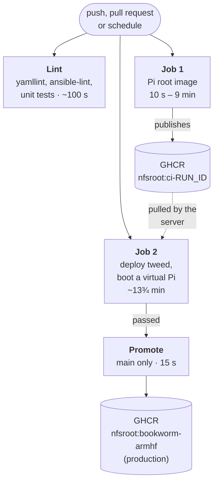
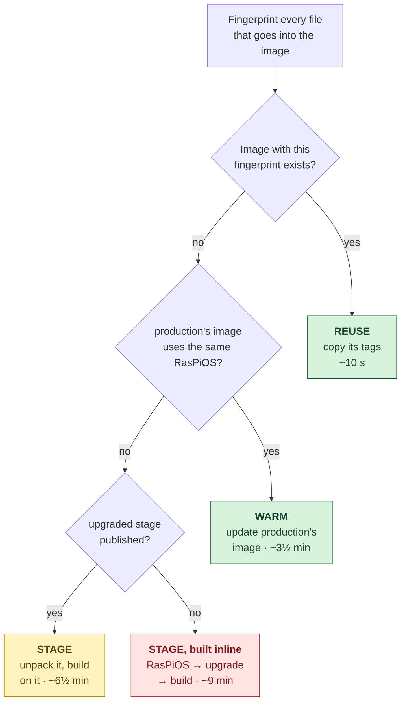
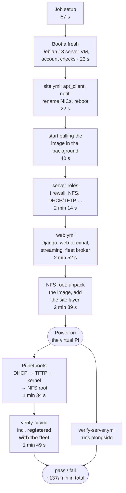

# How CI works

CI answers one question for every push and pull request: **would a fresh
deploy of tweed from this checkout work?**

Tweed is the server that network-boots ("netboots") the Raspberry Pis
attached to the FPGA boards. A deploy of tweed works when a Pi can netboot
from the new server, come up correctly, and register itself with the
server's fleet. CI tests exactly that. It:

1. deploys a brand-new server, a stand-in for tweed, with
   [`ansible/site.yml`](../ansible/site.yml), exactly as a real deploy
   does;
2. powers on a virtual Raspberry Pi, which netboots from that server; and
3. checks both sides, including that the Pi appears online in the server's
   fleet.

A netbooted Pi mounts its root filesystem over the network from the
server. The server does not build that filesystem itself: it downloads a
prebuilt **Pi root image**. So CI builds that image too, from the same
checkout, and the test server downloads it. That way a change to the Pi's
roles is tested in the root the virtual Pi boots. The image build supports
the test; it is not a goal of its own.
[Section 2](#2-job-1-the-pi-root-image-nfsroot-buildyml) covers how the
image is built, and how CI avoids rebuilding it when nothing in it has
changed.

On `main`, one more thing happens after the test passes: the tested image
becomes the one production pulls
([section 4](#4-promotion-the-image-production-pulls)). An image that has
not netbooted a Pi never reaches production.

Three workflows are involved:

| Workflow | File | Runs on | Typical duration | Example run |
|---|---|---|---|---|
| VM Integration Tests | [`vm-test.yml`](../.github/workflows/vm-test.yml) | every push to `main`, every PR to `main`, a schedule (asked for hourly, see [§2.3](#23-why-there-are-several-ways-to-produce-it)), manual dispatch | **12½–15 min** of work; see [§6](#6-timings) for the cases that take longer | [36360458088](https://github.com/fpgas-online/fpgas.online-infra/actions/runs/36360458088) (`main`, scheduled, 14:08) |
| nfsroot build (the Pi root image) | [`nfsroot-build.yml`](../.github/workflows/nfsroot-build.yml) | only when the VM test calls it. It has no triggers of its own | 10 s, ~3½ min, ~6½ min or ~9 min: see [§2.3](#23-why-there-are-several-ways-to-produce-it) | the `nfsroot /` jobs of any VM test run |
| Lint | [`lint.yml`](../.github/workflows/lint.yml) | every push to `main` and every PR | ~100 s | [36507488573](https://github.com/fpgas-online/fpgas.online-infra/actions/runs/36507488573) |

Every duration in this document was measured on a real run, and links to
the run or job it came from. Estimates are marked as such.

---

## 1. The big picture

This section shows how the jobs fit together, so that the later sections
make sense on their own.

Every push to `main` and every pull request starts two workflows: Lint and
the VM test. The VM test workflow runs **two jobs at the same time**:

- **Job 1** produces the Pi root image. It builds the image from the
  checkout, or reuses an earlier one when nothing that goes into the image
  has changed. It publishes the image to the GitHub container registry
  (**GHCR**, `ghcr.io`).
- **Job 2** is the test itself. It deploys a new server and boots a
  virtual Pi from it. The server downloads the image from GHCR.

On `main` only, a third job, **Promote**, runs once both have passed. It
points the tag production pulls at the image Job 2 just tested.

### Overview


```mermaid
%%{init: {"themeVariables": {"fontSize": "20px"}}}%%
flowchart TB
    trigger(["push, pull request<br/>or schedule"])
    lint["<b>Lint</b><br/>yamllint, ansible-lint,<br/>unit tests · ~100 s"]
    job1["<b>Job 1</b><br/>Pi root image<br/>10 s – 9 min"]
    job2["<b>Job 2</b><br/>deploy tweed,<br/>boot a virtual Pi<br/>~13¾ min"]
    ghcr[("GHCR<br/>nfsroot:ci-RUN_ID")]
    promote["<b>Promote</b><br/>main only · 15 s"]
    prod[("GHCR<br/>nfsroot:bookworm-armhf<br/>(production)")]
    trigger --> lint
    trigger --> job1
    trigger --> job2
    job1 -- publishes --> ghcr
    ghcr -. "pulled by the<br/>server" .-> job2
    job2 -- "passed" --> promote
    promote --> prod
```

The two jobs meet at one point, the dotted arrow: the server in Job 2
downloads the image that Job 1 published. The server needs the image only
in the last play of `site.yml`, about 7½ minutes after the job starts, and
the download takes 35–65 s. So Job 1 can take up to about 6½ minutes
without delaying anything. On scheduled runs Job 1 waits for the stages
job first ([§2.7](#27-the-stages-job-scheduled-runs)), which puts it
right at that limit ([§6.2](#62-scheduled-runs)).

### Job 1: which image the test gets

Job 1 first computes a fingerprint of every file that goes into the image.
This fingerprint is the **inputs key**. The job then takes the cheapest
path that still gives an image matching this checkout:

- **Reuse:** an image with the same inputs key already exists. The job
  gives it this run's tags and builds nothing.
- **Warm:** the inputs changed, but the Raspberry Pi OS (RasPiOS) base did
  not. The job starts from the image production currently pulls and
  applies only the changes.
- **Stage:** the RasPiOS base changed, or the run asks for a clean build.
  The job starts from a published **stage image**: RasPiOS with every
  package already upgraded. If no stage image exists yet for this base, it
  builds one first.


```mermaid
%%{init: {"themeVariables": {"fontSize": "20px"}}}%%
flowchart TB
    key["Fingerprint every file<br/>that goes into the image"]
    q1{"Image with this<br/>fingerprint exists?"}
    q2{"production's image<br/>uses the same RasPiOS?"}
    q3{"upgraded stage<br/>published?"}
    reuse["<b>REUSE</b><br/>copy its tags<br/>~10 s"]
    warm["<b>WARM</b><br/>update production's<br/>image · ~3½ min"]
    unpacked["<b>STAGE</b><br/>unpack it, build<br/>on it · ~6½ min"]
    inline["<b>STAGE, built inline</b><br/>RasPiOS → upgrade<br/>→ build · ~9 min"]
    key --> q1
    q1 -- yes --> reuse
    q1 -- no --> q2
    q2 -- yes --> warm
    q2 -- no --> q3
    q3 -- yes --> unpacked
    q3 -- no --> inline
    classDef fast fill:#d8f3dc,stroke:#2d6a4f,color:#1b4332
    classDef mid fill:#fff3bf,stroke:#b08900,color:#5c4400
    classDef slow fill:#ffe3e3,stroke:#c92a2a,color:#7d1a1a
    class reuse,warm fast
    class unpacked mid
    class inline slow
```

Most runs take the reuse or warm path (green). Both finish before the
server needs the image. The stage path (yellow) finishes around the time
the server needs it, so the server may wait up to about 1½ minutes. The
inline path (red) runs when a PR changes how the stages are built; there
the server waits about 2 minutes for the image.
[Section 2.3](#23-why-there-are-several-ways-to-produce-it) explains why
there are several paths.

### Job 2: the test

Job 2 runs the production deploy on a fresh server VM, then boots the
virtual Pi and checks both machines. The times are from
[run 36360458088](https://github.com/fpgas-online/fpgas.online-infra/actions/runs/36360458088/job/108736476082),
a scheduled run started 2026-09-27 23:58 UTC. Its total, 14:08, is
typical of the scheduled runs since
[PR #137](https://github.com/fpgas-online/fpgas.online-infra/pull/137)
(median 14:11, [§6.2](#62-scheduled-runs)).


```mermaid
%%{init: {"themeVariables": {"fontSize": "20px"}}}%%
flowchart TB
    setup["Job setup<br/>57 s"]
    srv["Boot a fresh<br/>Debian 13 server VM,<br/>account checks · 23 s"]
    s1["site.yml: apt_client, netif,<br/>rename NICs, reboot<br/>22 s"]
    s2["start pulling the<br/>image in the background<br/>40 s"]
    s3["server roles<br/>firewall, NFS, DHCP/TFTP …<br/>2 min 14 s"]
    s4["web.yml<br/>Django, web terminal,<br/>streaming, fleet broker<br/>2 min 52 s"]
    s5["NFS root: unpack<br/>the image, add<br/>the site layer<br/>2 min 39 s"]
    pion(["Power on<br/>the virtual Pi"])
    boot["Pi netboots<br/>DHCP → TFTP → kernel<br/>→ NFS root<br/>1 min 34 s"]
    vp["verify-pi.yml<br/>incl. <b>registered<br/>with the fleet</b><br/>1 min 49 s"]
    vs["verify-server.yml<br/>runs alongside"]
    result(["pass / fail<br/>~13¾ min in total"])
    setup --> srv --> s1 --> s2 --> s3 --> s4 --> s5 --> pion
    pion --> boot --> vp --> result
    pion --> vs --> result
```

- Everything from `site.yml` to the NFS root is the production playbook,
  run exactly as it runs on tweed, with nothing skipped.
- The **site layer** is the part of the Pi root that differs per site:
  passwords, SSH keys and site configuration. The published image has none
  of it; each server adds its own (see [§2.1](#21-what-the-image-is-and-why-ci-builds-it)).
- The Pi is powered on only after the server is fully deployed, just as
  real boards are power-cycled over PoE after a deploy.
- The server's checks run while the Pi boots, so they add no time.

---

## 2. Job 1: the Pi root image ([`nfsroot-build.yml`](../.github/workflows/nfsroot-build.yml))

This section covers the job that produces the Pi root image: what the
image contains, where it is published, how the job decides how much to
build, and what the build does. Read it when a change touches the Pi's
software, or when this job fails.

### 2.1 What the image is, and why CI builds it

Every netbooted Pi mounts the same root filesystem read-only over NFS, from
the server's `/srv/nfs/rpi/bookworm`. Writes go to a tmpfs overlay (a
RAM-backed layer on top of the read-only root). The tree holds two
directories:

- `boot/` is what the Pis fetch over TFTP: the kernels, device trees and
  `config.txt`.
- `root/` is the Raspberry Pi OS userland, with the fpgas.online packages
  and settings baked in.

The server used to build this tree itself. It ran the Pi roles inside the
ARM root under `qemu-user` emulation, which took about two hours per
rebuild. Since [issue #34](https://github.com/fpgas-online/fpgas.online-infra/issues/34)
and [PR #63](https://github.com/fpgas-online/fpgas.online-infra/pull/63), a
GitHub **arm64 runner** builds it instead. The runner executes the Pi's
32-bit ARM programs natively, with no emulation. The measurements showing
the runner is fit for this are in the trial-run PR,
[PR #40](https://github.com/fpgas-online/fpgas.online-infra/pull/40).
The runner publishes the result as a container image. Every server, tweed
and the CI test server alike, just downloads it
([`img/tasks/pull.yml`](../ansible/roles/img/tasks/pull.yml)).

The published image is **site-agnostic**: it contains no passwords, SSH
keys or site configuration. Each server adds its own site layer after
downloading the image, in the last play of `site.yml`
([`fixpi`](../ansible/roles/fixpi/tasks/main.yml)).

### 2.2 Where it is published: container registry tags (not git tags)

The image lives in GHCR at
[`ghcr.io/fpgas-online/nfsroot`](https://github.com/fpgas-online/fpgas.online-infra/pkgs/container/nfsroot).
It is an OCI (standard container) image, about 4.05 GB uncompressed and
1.64 GB compressed with zstd, split into **4 layers** of about equal size.
Its filesystem holds `boot/` and `root/`.

Why 4 layers: GHCR serves a freshly pushed blob at only ~35–80 MB/s per
connection, and podman downloads an image's layers in parallel. Measured
with the real root, a cold `podman pull` takes 48–75 s for one layer and
23–33 s for four; eight layers gain nothing more, because podman applies
the layers one at a time. Splitting does not speed up the push. The
numbers are in the comment above `LAYERS` in
[`nfsroot_publish.py`](../tests/ci/nfsroot_publish.py), and in
[PR #144](https://github.com/fpgas-online/fpgas.online-infra/pull/144).
Each layer also carries the real entries of every directory above its
contents, so the split cannot change a directory's mode or owner; a test
in the Lint workflow round-trips the split through podman and tar
([§5](#5-lint-lintyml)).

The "tags" below are **image tags in that registry**: the name after the
`:` in `podman pull ghcr.io/fpgas-online/nfsroot:<tag>`. **Nothing is
tagged in git.**

[`tests/ci/nfsroot_publish.py`](../tests/ci/nfsroot_publish.py) (`tags()`)
gives each image several tags. The examples are from the `main` run
[36296701678](https://github.com/fpgas-online/fpgas.online-infra/actions/runs/36296701678/job/108556769990):

| Tag | Set by | Purpose | Example |
|---|---|---|---|
| `bookworm-armhf-YYYYMMDD-<sha7>` | every build | pinnable identity of this build; the workflow's `image` output. Pin one in a deploy for reproducibility | `bookworm-armhf-20260927-e56c662` ([e56c662](https://github.com/fpgas-online/fpgas.online-infra/commit/e56c662)) |
| `ci-<run_id>` | every build | the tag the VM test pulls. Its name is known before the build starts, so the VM test can start at the same time. Also the tag Promote copies | `ci-36296701678` |
| `inputs-<key>` | every build, pushed **last** | the inputs key: a fingerprint of everything that went into the image, so later runs can find it and reuse it ([§2.4](#24-how-the-path-is-chosen)) | `inputs-571171820156379b8eb3` |
| `bookworm-armhf` | **only the Promote job**, on `main`, after the test passed ([§4](#4-promotion-the-image-production-pulls)) | what production pulls unless a deploy pins another tag ([`img_nfsroot_image`](../ansible/roles/img/defaults/main.yml)), and the starting point for warm builds | `bookworm-armhf` |

The two stage images ([§2.3](#23-why-there-are-several-ways-to-produce-it))
live in the same repository under their own tags: `base-<base_key>`,
`upgraded-<upgraded_key>`, and `upgraded-<upgraded_key>-<UTC hour>` for
each refresh.

Every tag must point at a single image manifest
([OCI manifest](https://github.com/opencontainers/image-spec/blob/main/manifest.md)),
never at an [image index](https://github.com/opencontainers/image-spec/blob/main/image-index.md)
(a list of per-architecture manifests). `assert_plain_manifest()` in
`nfsroot_publish.py` checks this after each push.

The reason is architecture:

- The image is labelled arm64, and the servers are amd64.
- `podman pull` accepts a plain manifest of any architecture, but refuses
  an index that has no amd64 entry.
- `docker buildx imagetools create` produces exactly such an index, and it
  once broke the rolling tag.

[PR #104](https://github.com/fpgas-online/fpgas.online-infra/pull/104) fixed
that by copying tags with [skopeo](https://github.com/containers/skopeo)
`copy --preserve-digests` instead.

### 2.3 Why there are several ways to produce it

This section explains why Job 1 does not simply build the image from
nothing every time.

**The problem.** A full build starts from the RasPiOS release image,
whose packages are more than a year behind the archive. Downloading it,
upgrading every package and then running the Pi roles took about 9½
minutes ([example job](https://github.com/fpgas-online/fpgas.online-infra/actions/runs/36052538261/job/107811379717)).
The deploy test needs the image about 7 minutes in, so every such run
waited, and took 15–17½ minutes.

**The observation.** Most pull requests don't change what goes into the
image: they touch server roles, the web tier or tests. Most of those that
do change it only a little, such as one role or one package. Only a new
RasPiOS release, or a change to how RasPiOS is unpacked, changes its
foundation. And the slowest part of a full build, upgrading RasPiOS's
packages, is the same for every checkout.

So the build does the least work that still gives an image that is correct
for this checkout:

| Path | Used when | What it does | Why it is safe | Build job |
|---|---|---|---|---|
| **Reuse** | nothing that goes into the image changed since an earlier build this hour (same `inputs-<key>`) | copies the existing image's tags, and builds nothing | same inputs in the same hour produce the same image | [10 s](https://github.com/fpgas-online/fpgas.online-infra/actions/runs/36296701678/job/108556769990) |
| **Warm** | something changed, but the RasPiOS base is the same | unpacks the image production pulls, then runs the Pi roles over it, so only the difference gets applied | the roles are idempotent Ansible: running them on an already-configured tree only changes what differs. Tweed converged its live root this way for years | [4 min 21 s](https://github.com/fpgas-online/fpgas.online-infra/actions/runs/36294289660/job/108550142792) |
| **Stage** | the RasPiOS base changed, or a clean build was asked for | unpacks the published **upgraded stage** for this base, then runs every Pi role on it | the stage is exactly the tree a full build reaches before the Pi roles: RasPiOS with `apt upgrade` applied | [6 min 2 s](https://github.com/fpgas-online/fpgas.online-infra/actions/runs/36286653956/job/108528600883) |
| **Stage, built inline** | as above, but no stage exists yet for this base | builds the two stages first (download and unpack RasPiOS, then upgrade it), then runs every Pi role | the only way to switch to a new base, and it proves a clean build still works | [8 min 36 s](https://github.com/fpgas-online/fpgas.online-infra/actions/runs/36240570194/job/108400154022) |

**The two stage images** are built by
[`tests/ci/nfsroot_stages.py`](../tests/ci/nfsroot_stages.py):

- **base** (`base-<base_key>`,
  [`ci-nfsroot-base.yml`](../ansible/ci-nfsroot-base.yml)): the RasPiOS
  release image, downloaded and unpacked into `boot/` and `root/`.
- **upgraded** (`upgraded-<upgraded_key>`,
  [`ci-nfsroot-upgrade.yml`](../ansible/ci-nfsroot-upgrade.yml)): the base
  with every package upgraded, and nothing of ours added. It is 2.09 GB
  uncompressed, 0.97 GB zstd.

A PR build that has to build them inline publishes only the upgraded
stage, so every later run for the same base unpacks it.

Three rules stop the shortcuts from producing a stale image:

- **The UTC hour is part of the inputs key.** The roles install whatever
  the package repositories serve at the time. So even an unchanged
  checkout gets a fresh (warm) build every hour it is tested, which picks
  up new packages.
- **Scheduled runs refresh the upgraded stage.** The VM test workflow has
  a schedule, `47 * * * *`. Its **stages** job runs first
  ([§2.7](#27-the-stages-job-scheduled-runs)) and rebuilds the upgraded
  stage on the published base, so a stage build starts from today's
  packages. The build job then builds the image as usual, and the run
  tests and promotes it.
- **About once a day, a scheduled run starts from scratch.** The first
  scheduled run after the published base stage turns 24 hours old
  rebuilds both stages from the RasPiOS download, and builds the image on
  them instead of warm. A warm image is layered on top of older ones, and
  can carry leftovers (removed files, old configuration) that a clean
  build would not have. This limits that drift to about a day, and keeps
  the full path tested.

**GitHub's schedule is best effort.** The schedule asks for hourly, but
from 2026-09-25 14:10 to 2026-09-29 01:16 UTC GitHub started only 20
scheduled runs, about one every 4 hours, and dropped the rest. The gaps
between them ranged from 10 minutes to 8½ hours. So production's image
can trail the package repositories by up to about 8½ hours. The daily
clean build goes by the base stage's age, not by which cron fired, so a
late or dropped run cannot skip it
([PR #133](https://github.com/fpgas-online/fpgas.online-infra/pull/133)).
A manual **from_scratch** run ([§7](#7-running-it-yourself)) also
publishes a new base stage, which restarts the 24 hours. For example,
after the from-scratch run
[36314142462](https://github.com/fpgas-online/fpgas.online-infra/actions/runs/36314142462)
on 2026-09-27 10:56 UTC, the next clean scheduled build was
[36436296084](https://github.com/fpgas-online/fpgas.online-infra/actions/runs/36436296084),
on 2026-09-28 14:28 UTC.

### 2.4 How the path is chosen

The build job tries each path in turn and takes the first that applies.

1. **Reuse?** The step "Reuse an image built from the same inputs" runs
   `nfsroot_publish.py --reuse`. It computes `key()` in
   [`tests/ci/nfsroot_inputs.py`](../tests/ci/nfsroot_inputs.py): a SHA-256
   of the UTC hour plus the content of every git-tracked file listed in
   `INPUTS`. Those are:
   - [`ci-nfsroot.yml`](../ansible/ci-nfsroot.yml) and the stage playbooks
     [`ci-nfsroot-base.yml`](../ansible/ci-nfsroot-base.yml),
     [`ci-nfsroot-upgrade.yml`](../ansible/ci-nfsroot-upgrade.yml) and
     [`ci-nfsroot-runner.yml`](../ansible/ci-nfsroot-runner.yml);
   - [`inventory-ci-nfsroot/`](../ansible/inventory-ci-nfsroot/) and the
     production group_vars it symlinks;
   - [`filter_plugins/`](../ansible/filter_plugins/) and
     [`ansible.cfg`](../ansible.cfg);
   - the roles [`img`](../ansible/roles/img/),
     [`fixpi`](../ansible/roles/fixpi/),
     [`nspawn_pi`](../ansible/roles/nspawn_pi/),
     [`fpgas_apt`](../ansible/roles/fpgas_apt/),
     [`cam_pi`](../ansible/roles/cam_pi/) and
     [`onpi`](../ansible/roles/onpi/);
   - the TT catalogue template;
   - the build machinery itself: `nfsroot-build.yml`,
     [`.github/actions/nfsroot-setup`](../.github/actions/nfsroot-setup/action.yml),
     `tests/ci/`, `requirements.yml`, `pyproject.toml` and `uv.lock`.

   Run `uv run tests/ci/nfsroot_inputs.py --list` to print the list.

   If `inputs-<key>` already exists in the registry, its manifest is copied
   to this run's tags and every later step is skipped. For example, the
   `main` push after a PR merge usually reuses the PR's image, because the
   merged files are identical. Reuse is skipped when the stages job has
   just rebuilt the stages from scratch, because that run exists to build
   on them.

   [`tests/test_nfsroot_inputs.py`](../tests/test_nfsroot_inputs.py) fails
   if the build starts reading a role or file that `INPUTS` does not
   cover, so the key cannot silently go stale.
2. **Warm?** The step "Start from main's latest image (warm build)" runs
   [`tests/ci/nfsroot_warm.py`](../tests/ci/nfsroot_warm.py).
   - Every image carries the label `org.fpgas-online.nfsroot.base-key`,
     recording which RasPiOS base it descends from.
   - The **base key** (`base_key()`) covers only the image's identity:
     `dist`, `img_path`, `img_name` and `zip_name` as rendered from
     [`srv.yml`](../ansible/inventory/group_vars/all/srv.yml) and
     [`zz-ci-overrides.yml`](../ansible/inventory-ci-nfsroot/group_vars/all/zz-ci-overrides.yml),
     plus the files that download and unpack it: `ci-nfsroot-base.yml`,
     `ci-nfsroot-runner.yml`,
     [`img/tasks/build.yml`](../ansible/roles/img/tasks/build.yml) and
     [`img2files.sh`](../ansible/roles/img/files/img2files.sh).
   - If the label on `bookworm-armhf` matches this checkout's base key, the
     script copies that image down and untars its layers into
     `/srv/nfs/rpi/bookworm`. Since
     [PR #119](https://github.com/fpgas-online/fpgas.online-infra/pull/119),
     `bookworm-armhf` is always an image that passed the VM test, so a warm
     build never starts from an untested image.
3. **Otherwise the stage path.** The script logs
   `… descends from base X, this checkout's is Y: building on the upgraded RasPiOS stage instead`,
   and the step "Start from the upgraded RasPiOS stage" runs
   `nfsroot_stages.py ensure`:
   - it unpacks `upgraded-<upgraded_key>` if it is published. The
     **upgraded key** is the base key plus the files the upgrade reads
     (`UPGRADE_INPUTS`);
   - otherwise it unpacks the base stage (or builds it, downloading
     RasPiOS from the
     [`raspios-base`](https://github.com/fpgas-online/apt/releases/tag/raspios-base)
     release mirror, because downloads.raspberrypi.org has stalled CI for
     an hour), upgrades it, and publishes the upgraded stage.

### 2.5 Steps of the build job

The table lists every step of the job, with times from one warm and one
inline-stage run. Use it to see which step a failure or slowdown is in.

| Step | What it does | Warm ([job](https://github.com/fpgas-online/fpgas.online-infra/actions/runs/36294289660/job/108550142792)) | Stage, inline ([job](https://github.com/fpgas-online/fpgas.online-infra/actions/runs/36240570194/job/108400154022)) |
|---|---|---|---|
| Log in to GHCR | `docker login` with the workflow's `GITHUB_TOKEN` (`packages: write`) | 2 s | 1 s |
| Reuse … | [§2.4](#24-how-the-path-is-chosen) step 1; everything below runs only if nothing was reused | 1 s | 0 s |
| Set up the build | the [`nfsroot-setup`](../.github/actions/nfsroot-setup/action.yml) action: Python venv, the pinned Ansible collections (cached by [`requirements.yml`](../requirements.yml)'s hash), the RasPiOS download cache, and apt's downloaded `.deb`s from earlier builds (one cache entry per UTC day) | 16 s | 8 s |
| Start from main's latest image (warm build) | [§2.4](#24-how-the-path-is-chosen) step 2 | 62 s | 3 s (base mismatch) |
| Start from the upgraded RasPiOS stage | [§2.4](#24-how-the-path-is-chosen) step 3 | — | 184 s (built both stages) |
| **Build the NFS root** | `sudo ansible-playbook -i inventory-ci-nfsroot/hosts ci-nfsroot.yml --skip-tags pipw,keys` ([§2.6](#26-what-ci-nfsrootyml-does)) | **107 s** | **261 s** |
| Tidy / save the deb cache | only on a cache miss: keep only the `.deb`s (apt's root-owned `lock` and `partial/` broke the save), then save | — | — |
| Write nfsroot manifest | [`nfsroot_manifest.py`](../tests/ci/nfsroot_manifest.py) lists packages, boot file hashes and configs, uploaded as the `nfsroot-manifest` artifact | 4 s | 3 s |
| Publish to GHCR | `nfsroot_publish.py`: tar the tree into 4 zstd layers, `skopeo copy` to each tag, then check each tag is a plain manifest | 61 s | 51 s |

### 2.6 What [`ci-nfsroot.yml`](../ansible/ci-nfsroot.yml) does

This playbook is the build itself. It runs the same Pi roles a deploy used
to run on the server, in the same order. The difference is that the "Pi" is
the unpacked tree on the runner. Ansible reaches it through the
[`community.general.chroot`](https://github.com/ansible-collections/community.general/blob/main/plugins/connection/chroot.py)
connection, which runs tasks inside a directory tree as if it were a
separate machine
([`inventory-ci-nfsroot/hosts`](../ansible/inventory-ci-nfsroot/hosts)).

The tree it works on is already in `/srv/nfs/rpi/bookworm`: the warm
image, or the upgraded stage. The playbook:

1. **Prepares the runner** ([`ci-nfsroot-runner.yml`](../ansible/ci-nfsroot-runner.yml)):
   disables any registered `qemu-arm` binfmt handler. (A binfmt handler
   tells the kernel to run foreign binaries through an emulator.) A runner
   image once shipped one, and it made the runner emulate ARM code it can
   run natively, slowing every apt run 4–10×.
2. **Checks the tree is in place**, and fails if `root/etc/os-release` is
   missing.
3. **Runs the generic [`fixpi`](../ansible/roles/fixpi/) layer**, with
   `fixpi_image_build: true`
   ([`all.yml`](../ansible/inventory-ci-nfsroot/group_vars/all/all.yml)).
4. **Prepares the chroot** with
   [`nspawn_pi/tasks/chroot-prep.yml`](../ansible/roles/nspawn_pi/tasks/chroot-prep.yml):
   - mounts `/proc`, `/sys`, `/dev` and friends;
   - adds a `policy-rc.d` so no services start;
   - holds initramfs rebuilds until the end;
   - sets dpkg `force-unsafe-io` and pauses man-db;
   - bind-mounts the deb cache over `/var/cache/apt/archives`.
5. **Runs the Pi roles against the chroot:**
   [`fpgas_apt`](../ansible/roles/fpgas_apt/),
   [`cam_pi`](../ansible/roles/cam_pi/) and
   [`onpi`](../ansible/roles/onpi/).
6. **Syncs the kernel payload, then cleans up.** It first syncs the
   upgraded kernel payload into `boot/`, so the pruner keeps what the Pis
   will really boot. Then [`nspawn_pi/tasks/stop.yml`](../ansible/roles/nspawn_pi/tasks/stop.yml)
   rebuilds stale initramfs images in parallel
   ([`nfsroot_kernels.py`](../ansible/roles/nspawn_pi/files/nfsroot_kernels.py)),
   prunes superseded kernels and unmounts everything.
7. **Makes the image site-agnostic and finishes `boot/`.** It points
   `resolv.conf` at the site gateway, deletes any SSH host keys that
   package installs generated and any `authorized_keys`, because every
   site brings its own. Then it re-syncs `boot/`.
8. **Asserts before anything is published:**
   - every board family's boot files exist (`kernel*.img` and the Pi 3, 4
     and 5 DTBs);
   - the key packages are `install ok installed`;
   - the `pi` user exists.

`--skip-tags pipw,keys` leaves out the password and SSH-key tasks. Those
belong to the site layer, which each server's own `fixpi` run adds in the
last play of `site.yml`. The VM test runs that play in full. This is the
only tag skip anywhere in CI.

### 2.7 The stages job (scheduled runs)

On scheduled runs and on a manual dispatch with `from_scratch`, the
**stages** job runs before the build job, on another arm64 runner. It runs
[`nfsroot_stages.py`](../tests/ci/nfsroot_stages.py) in one of two modes:

| Mode | When | What it does | Time |
|---|---|---|---|
| refresh (`scheduled` → `upgraded`) | the published base stage is less than 24 hours old | unpacks the base stage, upgrades it, publishes a new upgraded stage | 2:58–3:41 over the 7 refreshes since 2026-09-27 11:14 UTC, e.g. [3:04](https://github.com/fpgas-online/fpgas.online-infra/actions/runs/36360458088/job/108736476209) |
| full (`scheduled` → `all`, or `all` on dispatch) | the base stage is 24 hours old or more, missing, or has no build-time label | downloads RasPiOS, publishes a new base stage, upgrades it, publishes a new upgraded stage | [3:59](https://github.com/fpgas-online/fpgas.online-infra/actions/runs/36286645309/job/108530395517) and [5:01](https://github.com/fpgas-online/fpgas.online-infra/actions/runs/36436296084/job/108974982880) |

The stages job logs its decision, e.g. `base stage age: 18.9 h; rebuilding
upgraded`. It writes `scratch=true` after a full rebuild. The build job
then skips reuse and the warm start, and builds on the fresh stages.

The build job starts only when the stages job has finished. So on every
scheduled run, the image is published about 6½ minutes after the run
starts even when the build itself is warm, which is about when the
server needs it ([§6.2](#62-scheduled-runs)).

---

## 3. Job 2: deploy and boot ([`vm-test.yml`](../.github/workflows/vm-test.yml), job "Server + Pi PXE Boot")

This section walks through the test job in order: the job's setup steps,
then what the test harness does step by step, then how the test
inventory differs from production. Read it when the VM test fails or gets
slower.

The example times come from the scheduled `main` run
[36360458088, job 108736476082](https://github.com/fpgas-online/fpgas.online-infra/actions/runs/36360458088/job/108736476082)
(2026-09-27 23:58 UTC).

### 3.1 Job setup (40–57 s)

The job runs in a `node:22-trixie` container with `--device=/dev/kvm`,
because the Pi emulator, `qemu-rpi-system-arm`, is built for Debian trixie.
It needs newer libraries than the runner's Ubuntu 24.04 has.

| Step | What it does |
|---|---|
| Initialize containers | pulls `node:22-trixie` |
| Install system dependencies | `qemu-system-x86`, `qemu-utils`, `cloud-image-utils`, `systemd-container`, `openssh-client`, `curl` |
| Install qemu-rpi packages | from rpi-qemu's signed apt repo (`https://fpgas.online/rpi-qemu/trixie/`), with two **hard version gates**: `qemu-rpi-system-arm >= 2:0.1+95` (fixes a whole-VM freeze, [rpi-qemu#16](https://github.com/fpgas-online/rpi-qemu/pull/16)) and `qemu-rpi-pxeboot >= 2:0.1+100` (boot-directory fallback, [rpi-qemu#18](https://github.com/fpgas-online/rpi-qemu/pull/18)) |
| Enable KVM | the server VM uses KVM hardware acceleration; the Pi is always emulated in software (QEMU's TCG) |
| `uv sync`, collection cache, VM image cache | the [Debian 13 cloud image](https://cloud.debian.org/images/cloud/trixie/latest/) is cached under the key `vm-images-trixie-v1` |
| **Run VM integration tests** | `uv run tests/vm/run_tests.py --phase all --nfsroot-image ghcr.io/fpgas-online/nfsroot:ci-<run_id>` (12 min 41 s) |
| Show serial log tails | only on failure: prints the last 200 lines of every serial log into the job log |
| Upload serial logs | always: the `serial-logs` artifact |

The job timeouts, 180 min for this job and 60 min for each image job, are
far above normal run times. The real guards are the fail-fast checks inside
the harness, described below.

### 3.2 What [`run_tests.py`](../tests/vm/run_tests.py) does, step by step

Times are seconds since the harness started.

**0 s: the virtual switch.** `AccessPortSwitch(2101)` in
[`tests/vm/vswitch.py`](../tests/vm/vswitch.py) listens on two local
sockets:

- The server's second network card connects to the **trunk** port.
- The Pi's network card connects to the **access** port, where its frames
  get tagged into VLAN 2101.

VLAN 2101 is switch 1, port 1 in the per-port VLAN scheme
(`2000 + 100·switch + port`,
[`filter_plugins/port_vlans.py`](../ansible/filter_plugins/port_vlans.py)).
This is what a real Netgear S3300 access port does.

**0–11 s: the server VM** (`phase_server`; VM details in
[`tests/vm/vm_manager.py`](../tests/vm/vm_manager.py) `boot_server`).

- **Disk:** the harness uses the cached Debian 13 cloud image (tweed runs
  Debian 13) with a 20 GB overlay.
- **Key:** it generates a fresh ed25519 key for the run.
- **cloud-init seed** ([`tests/vm/cloud_init.py`](../tests/vm/cloud_init.py)):
  - installs **no packages**, because the roles install what they need,
    as on a fresh tweed;
  - brings up DHCP on the kernel's name for the first NIC;
  - pre-seeds a self-signed certificate at
    `/etc/letsencrypt/live/test.fpgas.online`;
  - recreates the accounts an older tweed has, for the deploy to fix:
    the server account under its old name, the `pi` and `tim` accounts
    trusting the revoked static keys, and the leftover `piroot` account
    from the removed `nspawn_pi` role, with its sudoers file and chroot
    login shell.
- **QEMU:** KVM with every runner CPU and 8 GB RAM. Disk writes skip host
  flushes (`cache=unsafe`), because the VM is thrown away afterwards.
  - NIC 1 is QEMU user networking (uplink, and SSH on port 2222), with
    `ipv6=off`.
  - NIC 2 is the VLAN trunk.
- **Readiness:** the harness waits for SSH, then for
  `cloud-init status --wait`, and fails if its exit code is non-zero.

**11–23 s: account checks before the deploy.** The fresh server still
accepts password logins, as a freshly installed tweed does. The harness
records that, checks that the revoked static keys and the whole `piroot`
account are there, and runs the `server_user` role in `--check` mode,
which must report the pending account rename without making it.

**23–549 s: `ansible-playbook site.yml -i tests/inventory/test-hosts --limit test-vm -e img_nfsroot_image=…:ci-<run_id>`.**
This is the production playbook with **no `--skip-tags`, no `--become` and
no key override**. The SSH key comes from
[`tests/inventory/group_vars/all/controller.yml`](../tests/inventory/group_vars/all/controller.yml),
and privilege escalation from [`ansible.cfg`](../ansible.cfg), exactly as
in production. The plays run in this order:

| # | Play | What happens | Time |
|---|---|---|---|
| 1 | [`apt_client`](../ansible/roles/apt_client/), [`netif`](../ansible/roles/netif/) | `apt_client` writes the host's apt proxy settings (none in the test, see [§3.3](#33-how-the-test-inventory-differs-from-production-and-why)). `netif` renames the fresh VM's `enp0s2`/`enp0s3` to `eth-uplink`/`eth-local` by MAC address, moves the uplink onto a static systemd-networkd config and **reboots**: the path a newly installed tweed takes | 22 s |
| 2 | [`img/tasks/prefetch.yml`](../ansible/roles/img/tasks/prefetch.yml) | installs podman and rsync, refreshing the apt lists first, because a fresh server has none. Then starts `podman pull` **in the background** | 40 s |
| 3 | [`automation_user`](../ansible/roles/automation_user/), [`operators`](../ansible/roles/operators/), [`jump`](../ansible/roles/jump/), [`sshd`](../ansible/roles/sshd/), [`lldp`](../ansible/roles/lldp/), [`firewall`](../ansible/roles/firewall/), [`vlan_ports`](../ansible/roles/vlan_ports/), [`switch_vlans`](../ansible/roles/switch_vlans/), [`nfs`](../ansible/roles/nfs/), [`apt_cache`](../ansible/roles/apt_cache/), [`pxe`](../ansible/roles/pxe/) | real apt and pip installs on a fresh OS. `pxe` (dnsmasq DHCP/TFTP) comes before the web tier, because the site role drops config into `/etc/dnsmasq.d` | 2 min 14 s |
| 4 | [`uhubctl`](../ansible/roles/uhubctl/) | no hosts, same as production | 0 s |
| 5 | [`web.yml`](../ansible/web.yml) | [`server_user`](../ansible/roles/server_user/), [`site`](../ansible/roles/site/) (Django), [`wssh`](../ansible/roles/wssh/) (web terminal), [`stream_server`](../ansible/roles/stream_server/), [`mqtt`](../ansible/roles/mqtt/) (fleet broker), [`webrtc`](../ansible/roles/webrtc/), [`ttsite`](../ansible/roles/ttsite/) (tinytapeout) | 2 min 52 s |
| 6 | NFS root (last play) | see below | 2 min 39 s |

The last play does this, in order:

1. **Takes the NFS root update lock**
   ([`nfsroot_generation/begin.yml`](../ansible/roles/nfsroot_generation/tasks/begin.yml)),
   so booted boards never reboot into a half-built root
   ([PR #97](https://github.com/fpgas-online/fpgas.online-infra/pull/97)).
2. **Unpacks the image**
   ([`img/tasks/pull.yml`](../ansible/roles/img/tasks/pull.yml)). It waits
   for the background download and reports how long the download itself
   took: `pulled in 44 s (attempt 25)` in this run. The background loop
   had polled for about 4 minutes, because on a scheduled run the image
   is published only after the stages job
   ([§2.7](#27-the-stages-job-scheduled-runs)). Then it runs the
   authoritative `podman pull`, and `podman image mount` +
   `rsync -aHAX --delete --checksum` copy the image into
   `/srv/nfs/rpi/bookworm` (75 s in this run; 37–42 s in most).
3. **Points the root's apt at the site's cache**
   ([`apt_cache/tasks/nfsroot.yml`](../ansible/roles/apt_cache/tasks/nfsroot.yml)).
4. **Applies the site layer** ([`fixpi`](../ansible/roles/fixpi/)):
   - the `pi` password and SSH keys, plus SSH host keys;
   - [`fleet.toml`](../ansible/roles/fixpi/tasks/fleet-site.yml);
   - the TT catalogue;
   - `pistat_host`;
   - the Orange Pi DTBs.
5. **Publishes the new root generation and releases the lock**
   ([`nfsroot_generation`](../ansible/roles/nfsroot_generation/)).

Result: `ok=397 changed=194 failed=0 skipped=45` in 8 min 46 s. The
skipped tasks are ones whose `when:` condition is false on this host; the
harness passes no `--skip-tags`.

**The pull retries only errors that can go away.** The retryable errors,
`img_pull_retryable` in
[`img/defaults/main.yml`](../ansible/roles/img/defaults/main.yml), are:

- `manifest unknown`, meaning the image isn't published yet;
- timeouts and connection resets;
- TLS errors, 5xx responses and 429s.

The test inventory raises the retry budget to 45 minutes
([`test-vm.yml`](../tests/inventory/host_vars/test-vm.yml)), so it covers
an image build that is still running. Any other error fails the play at
once: for example, an image podman can't use, or an auth failure.

**549 s: account checks after the deploy.** sshd must now offer only
public-key login (a password-only login is refused), the revoked static
keys must be gone, the account rename must have happened, and the
`piroot` account, its group, home, sudoers file and login shell must all
be gone ([PR #149](https://github.com/fpgas-online/fpgas.online-infra/pull/149)).

**550 s: the Pi is powered on** (`start_pi`). This is the moment a real
deploy's boards would be power-cycled over PoE. The emulator runs
`qemu-rpi-system-aarch64 -M raspi4b`, from
[rpi-qemu](https://github.com/fpgas-online/rpi-qemu), with the
`qemu-rpi-pxeboot` firmware: U-Boot plus an emulation of the Pi 4's network
boot sequence. The virtual Pi has no disk. From here, three things run
**at the same time**:

- **[`verify-server.yml`](../ansible/verify-server.yml)** runs in a
  background thread. It only reads, and its output is printed at the end.
  It runs every server role's own `verify/main.yml`, plus these checks:
  - the per-port VLAN interface, `dnsmasq --test`, the firewall's forward
    policy and `ports.conf`;
  - the NFS root's packages, and the nfsroot watchdog on both the server
    and the root;
  - that **the update lock was released**;
  - the `pi` user and its authorized_keys;
  - the site-layer files (`fleet.toml`, `tt-boards.yaml`);
  - the Wi-Fi-disable and EEPROM-write-protect lines in `config.txt`;
  - the web tier.

  Result: `ok=244 failed=0`, hidden behind the Pi phase.
- **The Pi boots.** `wait_for_pi_boot` watches both serial consoles:
  - **552 s:** DHCP from dnsmasq on `v2101`, then TFTP from the root's
    `boot/`. The firmware asks for `<serial>/start4.elf` first. When it
    doesn't find one, it falls back to the top-level directory, as the
    real bootloader does
    ([`TFTP_PREFIX`](https://www.raspberrypi.com/documentation/computers/raspberry-pi.html#TFTP_PREFIX):
    *"If neither start4.elf nor start.elf are found in the prefixed
    directory then the prefix is cleared"*).
  - **557 s:** the address from DHCP must be **10.21.1.1**, the per-port
    address of switch 1 port 1. Any other address fails the test.
  - **562 s:** the kernel starts ("Booting Linux"). If the firmware prints
    "No kernel image found" twice, the test fails at once instead of
    waiting 10 minutes.
  - **562–643 s:** the NFS root is mounted with overlayroot and userland
    starts, emulated at roughly a twentieth of real speed. The Pi counts
    as ready when SSH as `pi`, through the server, works.
- **643–752 s: [`verify-pi.yml`](../ansible/verify-pi.yml)** runs,
  alongside a password login as `pi` (`pi_password_login_works`). The
  password login is the path the board page's web terminal uses.
  - The playbook runs without sudo and without fact gathering. Each
    separate task costs seconds on the emulated Pi, so one task, "Collect
    the Pi's state" (76 s), runs a single Python script on the Pi that
    returns everything the checks need.
  - It checks:
    - the NFS and overlay mounts;
    - the per-port address and hostname;
    - that the Pi can ping the server;
    - sshd, and that the password is usable;
    - overlayroot and lldpd;
    - that the nfsroot watchdog is armed;
    - the fpgas.online openFPGALoader/OpenOCD builds;
    - the camera and TT services, and the demo bitstreams;
    - the FPGA boot check, `fpgas-verify`
      ([PR #137](https://github.com/fpgas-online/fpgas.online-infra/pull/137)): it is enabled, and its report gives the
      expected result. The virtual Pi has no FPGA, so the test expects
      `missing`, which checks the no-board path end to end
      ([§3.3](#33-how-the-test-inventory-differs-from-production-and-why));
    - that ifupdown isn't failing;
    - the fleet agent.
  - **Fleet registration:** on the server, it fetches `/fleet/<serial>/`
    from the Django app. The page must show `badge online` and the Pi's
    **current boot id**, which proves this boot registered.
  - Result: `ok=37 failed=0 skipped=13`. The 13 skips are checks for
    hardware the emulated Pi 4B doesn't have: the Pi 5 header UART, Orange
    Pi boards and the USB gadget console.

**752–758 s: teardown.** The harness prints both results, and exits
non-zero if either side or the password login failed. On a `verify-pi`
failure it first prints the server's network view of the Pi (neighbour
table, ping, VLAN counters, dnsmasq/NFS journal) and the Pi's last 200
console lines.

### 3.3 How the test inventory differs from production, and why

The test uses its own Ansible inventory. This section lists where it
differs from production, so you can tell which production settings the
test does not cover.

[`tests/inventory`](../tests/inventory/) symlinks these production
group_vars:
[`ci.yml`](../ansible/inventory/group_vars/all/ci.yml),
[`firewall.yml`](../ansible/inventory/group_vars/all/firewall.yml),
[`srv.yml`](../ansible/inventory/group_vars/all/srv.yml),
[`ssh_keys.yml`](../ansible/inventory/group_vars/all/ssh_keys.yml) and
[`streaming.yml`](../ansible/inventory/group_vars/all/streaming.yml).

The rest is test-only:
[`all.yml`](../tests/inventory/group_vars/all/all.yml),
[`site.yml`](../tests/inventory/group_vars/all/site.yml),
[`ttsite.yml`](../tests/inventory/group_vars/all/ttsite.yml),
[`controller.yml`](../tests/inventory/group_vars/all/controller.yml),
[`host_vars/test-vm.yml`](../tests/inventory/host_vars/test-vm.yml) and
[`host_vars/test-pi.yml`](../tests/inventory/host_vars/test-pi.yml).
Compare them with [tweed's host_vars](../ansible/inventory/host_vars/fpgas.online.yml).
They differ from production only where the test environment forces them
to:

| Difference | Why |
|---|---|
| `test.fpgas.online` names; documentation-range and TEST-NET addresses | there is no real DNS |
| `site_certbot: false`, `ttsite_certbot: false`; cloud-init seeds a self-signed certificate | no public DNS or inbound port 80 for Let's Encrypt. The HTTPS vhost code path still renders |
| `switches_manage: false` | there is no physical switch to configure over SNMP. The switch CLI install and config rendering still run |
| uplink static 10.0.2.15/24 via 10.0.2.2, DNS 10.0.2.3 | QEMU user networking's fixed addresses |
| `img_pull_retries` / `img_pull_delay` raised | the image may still be building when the pull starts |
| one switch with one access port; `tt_boards` with the virtual Pi as `fpga-1`; a dummy `sunxi_boards` row | exercises the TT, fleet and Orange Pi config paths |
| `controller.yml` names `tests/vm/workdir/test_key` | the per-run key, instead of `~/.ssh/fpgas.online-ansible` |
| no `apt_client_proxy` / `apt_client_https_cache`: the server's apt fetches directly | tweed's apt proxy (`apt_client_proxy` in its host_vars) is on a private address that a GitHub runner cannot reach. The role still runs, and removes any proxy setting |
| `verify_pi_fpga_expect: missing` ([`test-pi.yml`](../tests/inventory/host_vars/test-pi.yml)) | the virtual Pi has no FPGA attached, so `fpgas-verify` must report `missing` rather than `pass`. That checks the check runs and the Pi still boots and takes SSH without a board |

---

## 4. Promotion: the image production pulls

Production's servers pull `ghcr.io/fpgas-online/nfsroot:bookworm-armhf`
unless a deploy pins another tag
([`img_nfsroot_image`](../ansible/roles/img/defaults/main.yml)). Since
[PR #119](https://github.com/fpgas-online/fpgas.online-infra/pull/119),
**no build moves that tag.** Only the **Promote to bookworm-armhf** job in
`vm-test.yml` does, and only:

- on `main` (pushes, schedules and dispatches, never PRs);
- after both the image build and the VM test succeeded. A failed or
  cancelled run skips it, and production stays on the last image that
  passed.

It runs `nfsroot_publish.py --promote ghcr.io/fpgas-online/nfsroot:ci-<run_id>`:
a `skopeo copy --preserve-digests` of the exact image the virtual Pi
booted, then the plain-manifest check. It takes about 15 s
([example job](https://github.com/fpgas-online/fpgas.online-infra/actions/runs/36296701678/job/108558498863)),
and prints the new digest in the job summary.

Runs on `main` overlap: each has its own concurrency group, so none waits
for or cancels another (a PR's runs share one group, and a new push
cancels the old run). So an older run can finish after a newer one. To
keep the tag moving forward anyway
([PR #151](https://github.com/fpgas-online/fpgas.online-infra/pull/151)):

- the Promote jobs run one at a time (a job-level concurrency group);
- each first runs
  [`nfsroot_promote_guard.py`](../tests/ci/nfsroot_promote_guard.py). It
  finds the last successful promotion through the Actions API, and lets
  the copy run only if this run is newer: a newer commit on `main`
  (checked with `git merge-base --is-ancestor`), or a later run of the same
  commit, whose packages are fresher. Otherwise the copy is skipped, and
  the job summary says why, for example
  `91bfdc5 is newer than the promoted c3874fb`
  ([example run](https://github.com/fpgas-online/fpgas.online-infra/actions/runs/36306604591)).

For example, on 2026-09-29 the scheduled run
[36507110122](https://github.com/fpgas-online/fpgas.online-infra/actions/runs/36507110122) (commit `fab6b03`) started a
minute before the push run
[36507218355](https://github.com/fpgas-online/fpgas.online-infra/actions/runs/36507218355) for #156's merge (`cad28f0`),
but finished after it. Its Promote job skipped the copy with
`cad28f0, a newer commit than fab6b03, is already promoted`.

Runs that started before #151 merged still ran the old, unguarded
workflow. On 2026-09-27 one of them,
[36306587951](https://github.com/fpgas-online/fpgas.online-infra/actions/runs/36306587951), finished last and moved the
tag back to an image from one commit earlier. That image had passed the
test too; the next guarded run moved the tag forward again.

If a third promotion arrives while one runs and one waits, GitHub replaces
the waiting one, which then shows as cancelled; the newest build still
gets promoted.

[`tests/test_nfsroot_promotion.py`](../tests/test_nfsroot_promotion.py)
fails if any build starts publishing `bookworm-armhf` again, or if the
promotion loses its dependency on the test.

---

## 5. Lint ([`lint.yml`](../.github/workflows/lint.yml))

The Lint workflow checks YAML style and Ansible best practice, and runs the
unit tests of the CI tooling. Every step can fail it. It has two jobs,
which run at the same time
([example run](https://github.com/fpgas-online/fpgas.online-infra/actions/runs/36507488573), 101 s).

**`ansible-lint` job** ([example](https://github.com/fpgas-online/fpgas.online-infra/actions/runs/36507488573/job/109212087854), 56 s):

| Step | What it does | Time |
|---|---|---|
| Install linters | `uv sync`: ansible-lint 26.9.0 and yamllint 1.38.0, pinned in [`pyproject.toml`](../pyproject.toml)'s dev group, so CI and a local `uv run ansible-lint` report the same thing | 1 s |
| Install Ansible collections | the pinned collections from [`requirements.yml`](../requirements.yml), cached. Without them ansible-lint cannot parse playbooks that use `ansible.posix` modules, and silently skips them | 1 s (cache hit) |
| `uv run yamllint -c .yamllint.yml ansible/` ([config](../.yamllint.yml)) | YAML style | 2 s |
| `uv run ansible-lint`, in `ansible/` ([config](../.ansible-lint)) | Ansible best practice, with no rule skipped | 41 s |

**`pytest` job** ([example](https://github.com/fpgas-online/fpgas.online-infra/actions/runs/36507488573/job/109212087726), 97 s):
`uv run pytest -q tests` runs the unit tests in [`tests/`](../tests/)
(80 s; `93 passed, 6 skipped`). Among them:

- [`tests/test_nfsroot_inputs.py`](../tests/test_nfsroot_inputs.py) fails a
  PR that makes the image build read a file the inputs key does not cover
  ([§2.4](#24-how-the-path-is-chosen)).
- [`tests/test_nfsroot_promotion.py`](../tests/test_nfsroot_promotion.py)
  guards the promotion rules ([§4](#4-promotion-the-image-production-pulls)).
- [`tests/test_nfsroot_layers_podman.py`](../tests/test_nfsroot_layers_podman.py)
  packs a root-owned tree with the real layer split, then checks that
  podman's overlay merge and an in-order `tar -x` both reproduce it entry
  for entry. It needs sudo and podman, which this job has
  (`NFSROOT_PODMAN_TEST=1`), and skips elsewhere.

> **Known gap:** the 6 tests in
> [`tests/test_nfsroot_generation.py`](../tests/test_nfsroot_generation.py)
> are **skipped in CI** ("6 skipped" in the job log). They run the
> `nfsroot_generation` role against the `nfsroot-generation` command, which
> lives in [fpgas-online/nfsroot-watchdog](https://github.com/fpgas-online/nfsroot-watchdog),
> and they find it only through `NFSROOT_GENERATION` or a sibling checkout
> of that repo. The pytest job has neither, so they run only on machines
> that happen to have `nfsroot-watchdog` checked out next to this repo.

To fix a lint failure, fix the flagged code. Use a scoped
`# noqa: <rule>` with a reason only when the construct is deliberate.

> **History:** ansible-lint was advisory from 2026-04-04 (commit
> [dd68a50](https://github.com/fpgas-online/fpgas.online-infra/commit/dd68a50)) until 2026-09-25. By then it reported 397
> violations ([log](https://github.com/fpgas-online/fpgas.online-infra/actions/runs/36063159621/job/107846648901)), 411
> with the collections installed, while the job stayed green. PRs
> [#109](https://github.com/fpgas-online/fpgas.online-infra/pull/109) to [#112](https://github.com/fpgas-online/fpgas.online-infra/pull/112) fixed them, and
> [#115](https://github.com/fpgas-online/fpgas.online-infra/pull/115) made it blocking. The rules
> still skipped then were fixed one PR at a time, until
> [#156](https://github.com/fpgas-online/fpgas.online-infra/pull/156) emptied the `skip_list`.

---

## 6. Timings

This section answers "how long will CI take for my change?", with the
measured runs behind the answer. The target is 15 minutes. These cases
still exceed it:

- the **daily full rebuild**, about 19 minutes ([§6.2](#62-scheduled-runs));
- PRs whose image is **built inline**, about 16 minutes
  ([§6.1](#61-pr-runs-by-image-path));
- runs that **wait for a free runner**, plus the occasional run whose apt
  and pip downloads are slow; one scheduled refresh took 15:03
  ([§6.2](#62-scheduled-runs), [§6.3](#63-runs-on-main-queueing)).

"Total" is from the run's creation to its completion: what a PR author
waits for.

Since [PR #137](https://github.com/fpgas-online/fpgas.online-infra/pull/137)
(merged 2026-09-27 11:14 UTC), the test job has been about 45 s slower
than before; [§6.4](#64-where-the-time-goes) shows where. Runs before it
therefore took about 45 s less than the same case would now.

### 6.1 PR runs, by image path

Every successful PR run of the VM test from 2026-09-25 07:21 UTC (when the
stage images landed, [PR #114](https://github.com/fpgas-online/fpgas.online-infra/pull/114))
to 2026-09-27 05:00 UTC, grouped by the path its image took. All of these
predate #137:

| Path | Runs | Build job | Best | Median | Worst | Over 15 min |
|---|---|---|---|---|---|---|
| reuse | 7 | 10–14 s | 10:58 | 12:30 | 14:42 | 0 |
| warm | 23 | 3:10–4:21 | 9:28 | 12:56 | 18:40 ¹ | 1 ¹ |
| stage, unpacked | 2 | 5:56–6:02 | 12:39 | 12:45 | 12:52 | 0 |
| **stage, built inline** | 7 | 8:30–9:13 | 14:11 | **15:21** | **16:10** | **4** |

¹ [Run 36209310049](https://github.com/fpgas-online/fpgas.online-infra/actions/runs/36209310049):
its VM job waited 6 min 8 s for a free runner. The work itself took about
12½ minutes.

Every successful run since #137 that was not a scheduled one:

| Run | Trigger | Path | Build job | Server waited for the image | Total |
|---|---|---|---|---|---|
| [36325371721](https://github.com/fpgas-online/fpgas.online-infra/actions/runs/36325371721) | PR [#156](https://github.com/fpgas-online/fpgas.online-infra/pull/156) | **stage, built inline** | [8:38](https://github.com/fpgas-online/fpgas.online-infra/actions/runs/36325371721/job/108637006236) | 2:00 | **15:56** |
| [36501319247](https://github.com/fpgas-online/fpgas.online-infra/actions/runs/36501319247) | PR [#150](https://github.com/fpgas-online/fpgas.online-infra/pull/150) | warm | [3:33](https://github.com/fpgas-online/fpgas.online-infra/actions/runs/36501319247/job/109192572419) | 0 | 14:36 |
| [36507218355](https://github.com/fpgas-online/fpgas.online-infra/actions/runs/36507218355) | push of #156's merge | stage, unpacked (the stage #156's PR run had published) | [6:36](https://github.com/fpgas-online/fpgas.online-infra/actions/runs/36507218355/job/109211243569) | 1:27 | 13:13 |

"Server waited for the image" is how long the NFS root play sat waiting
for the download, beyond the ~10 s it always takes to collect it.

The **inline** path is the slow one: its image build takes 8½–9 minutes,
so the server waits about 2 minutes for the image. It runs when a PR
changes a file in the base key ([§2.4](#24-how-the-path-is-chosen)) and no
stage exists yet for the new key. Comment-only edits to those files count
too; [issue #135](https://github.com/fpgas-online/fpgas.online-infra/issues/135)
proposes ignoring them. Adding `mode:` to a task in
[`img/tasks/build.yml`](../ansible/roles/img/tasks/build.yml), as #156
did, is enough to trigger it.

### 6.2 Scheduled runs

Every scheduled run since #137:

| Run | Date (UTC) | Stages job | Build job | VM test job | Server waited for the image | Total |
|---|---|---|---|---|---|---|
| [36325419822](https://github.com/fpgas-online/fpgas.online-infra/actions/runs/36325419822) | 2026-09-27 | refresh [3:06](https://github.com/fpgas-online/fpgas.online-infra/actions/runs/36325419822/job/108637144385) | [3:22](https://github.com/fpgas-online/fpgas.online-infra/actions/runs/36325419822/job/108637683629) | [13:55](https://github.com/fpgas-online/fpgas.online-infra/actions/runs/36325419822/job/108637144075) | 0:11 | 14:14 |
| [36341432751](https://github.com/fpgas-online/fpgas.online-infra/actions/runs/36341432751) | 2026-09-27 | refresh [3:02](https://github.com/fpgas-online/fpgas.online-infra/actions/runs/36341432751/job/108682180449) | [3:15](https://github.com/fpgas-online/fpgas.online-infra/actions/runs/36341432751/job/108682720374) | [12:24](https://github.com/fpgas-online/fpgas.online-infra/actions/runs/36341432751/job/108682180270) | 0 | 12:49 |
| [36352408436](https://github.com/fpgas-online/fpgas.online-infra/actions/runs/36352408436) | 2026-09-27 | refresh [2:58](https://github.com/fpgas-online/fpgas.online-infra/actions/runs/36352408436/job/108713478812) | [3:17](https://github.com/fpgas-online/fpgas.online-infra/actions/runs/36352408436/job/108713983173) | [14:29](https://github.com/fpgas-online/fpgas.online-infra/actions/runs/36352408436/job/108713478606) | 0 | 14:51 |
| [36360458088](https://github.com/fpgas-online/fpgas.online-infra/actions/runs/36360458088) | 2026-09-27 | refresh [3:04](https://github.com/fpgas-online/fpgas.online-infra/actions/runs/36360458088/job/108736476209) | [3:18](https://github.com/fpgas-online/fpgas.online-infra/actions/runs/36360458088/job/108737004067) | [13:46](https://github.com/fpgas-online/fpgas.online-infra/actions/runs/36360458088/job/108736476082) | 0 | 14:08 |
| [36383814324](https://github.com/fpgas-online/fpgas.online-infra/actions/runs/36383814324) | 2026-09-28 | refresh [3:06](https://github.com/fpgas-online/fpgas.online-infra/actions/runs/36383814324/job/108804889149) | [3:16](https://github.com/fpgas-online/fpgas.online-infra/actions/runs/36383814324/job/108805588438) | [13:09](https://github.com/fpgas-online/fpgas.online-infra/actions/runs/36383814324/job/108804888854) | 0:54 | 13:29 |
| [36436296084](https://github.com/fpgas-online/fpgas.online-infra/actions/runs/36436296084) | 2026-09-28 | **full** [5:01](https://github.com/fpgas-online/fpgas.online-infra/actions/runs/36436296084/job/108974982880) | [6:37](https://github.com/fpgas-online/fpgas.online-infra/actions/runs/36436296084/job/108977188574) | [18:47](https://github.com/fpgas-online/fpgas.online-infra/actions/runs/36436296084/job/108974982476) | **4:00** | **19:14** |
| [36481816604](https://github.com/fpgas-online/fpgas.online-infra/actions/runs/36481816604) | 2026-09-28 | refresh [3:41](https://github.com/fpgas-online/fpgas.online-infra/actions/runs/36481816604/job/109129031434) | [3:33](https://github.com/fpgas-online/fpgas.online-infra/actions/runs/36481816604/job/109130467447) | [failed](https://github.com/fpgas-online/fpgas.online-infra/actions/runs/36481816604/job/109129030832) after 2:44 ² | — | — |
| [36507110122](https://github.com/fpgas-online/fpgas.online-infra/actions/runs/36507110122) | 2026-09-29 | refresh [3:01](https://github.com/fpgas-online/fpgas.online-infra/actions/runs/36507110122/job/109210905633) | [3:23](https://github.com/fpgas-online/fpgas.online-infra/actions/runs/36507110122/job/109211662508) | [14:20](https://github.com/fpgas-online/fpgas.online-infra/actions/runs/36507110122/job/109210905323) | 0 | **15:03** |

² The operators' SSH keys could not be fetched from GitHub
([§8](#8-when-it-fails-where-to-look)).

- **Refresh runs** took 12:49–15:03, median 14:11. Their build job waits
  for the stages job, so the image is published about 6½ minutes after
  the run starts, which is about when the server needs it. The server
  usually does not wait; once it waited 54 s. The one run over 15
  minutes spent 3:34 in the web tier, against 2:03–3:06 in the others:
  slow apt and pip downloads, not a change.
- **The daily full rebuild** took **19:14**. Its stages job (5:01) and
  image build (6:37) run one after the other, so the image exists only
  about 11¾ minutes in, and the server waited 4 minutes for it. The
  previous full rebuild,
  [36286645309](https://github.com/fpgas-online/fpgas.online-infra/actions/runs/36286645309)
  on 2026-09-27, took 16:05 of work: stages 3:59, build 5:48.

### 6.3 Runs on `main`: queueing

From [PR #119](https://github.com/fpgas-online/fpgas.online-infra/pull/119)
until [PR #151](https://github.com/fpgas-online/fpgas.online-infra/pull/151)
(merged 2026-09-27), runs on `main` never overlapped, so merges that landed
close together queued behind each other. GitHub's runners are also
sometimes all busy. Some of the longest runs from that period:

| Run | Total | Waiting for the previous `main` run | Waiting for a runner | Work |
|---|---|---|---|---|
| [36135216064](https://github.com/fpgas-online/fpgas.online-infra/actions/runs/36135216064) | 33:12 | 14:59 | 6:12 | 12:01 |
| [36281006120](https://github.com/fpgas-online/fpgas.online-infra/actions/runs/36281006120) | 30:28 | 17:20 | 0:06 | 13:02 |
| [36286645309](https://github.com/fpgas-online/fpgas.online-infra/actions/runs/36286645309) (scheduled, full) | 29:44 | 13:34 | 0:05 | 16:05 |
| [36295058552](https://github.com/fpgas-online/fpgas.online-infra/actions/runs/36295058552) | 23:41 | 0:00 | 10:21 | 13:20 |
| [36296701678](https://github.com/fpgas-online/fpgas.online-infra/actions/runs/36296701678) (no queue) | 13:22 | 0:00 | 0:04 | 13:17 |

Since #151, a `main` run no longer waits for the one before it. Of the 13
runs on `main` from #151's merge to 2026-09-29 01:17 UTC, two waited for
a runner:

- [36309577725](https://github.com/fpgas-online/fpgas.online-infra/actions/runs/36309577725):
  its VM test job started 1:51 after the run (total 17:24);
- [36309286087](https://github.com/fpgas-online/fpgas.online-infra/actions/runs/36309286087):
  its Promote job started 2:00 after the test finished (total 14:56).

Every other job started within 30 s.

### 6.4 Where the time goes

The test job, split into segments. It compares the reference run of
[§3](#3-job-2-deploy-and-boot-vm-testyml-job-server--pi-pxe-boot) with
the run the earlier version of this section used, from before #137, and
gives the range over eight runs since #137:
[36325419822](https://github.com/fpgas-online/fpgas.online-infra/actions/runs/36325419822),
[36341432751](https://github.com/fpgas-online/fpgas.online-infra/actions/runs/36341432751),
[36352408436](https://github.com/fpgas-online/fpgas.online-infra/actions/runs/36352408436),
[36360458088](https://github.com/fpgas-online/fpgas.online-infra/actions/runs/36360458088),
[36383814324](https://github.com/fpgas-online/fpgas.online-infra/actions/runs/36383814324),
[36501319247](https://github.com/fpgas-online/fpgas.online-infra/actions/runs/36501319247),
[36507110122](https://github.com/fpgas-online/fpgas.online-infra/actions/runs/36507110122) and
[36507218355](https://github.com/fpgas-online/fpgas.online-infra/actions/runs/36507218355).

| Segment | Before #137 ([36296701678](https://github.com/fpgas-online/fpgas.online-infra/actions/runs/36296701678/job/108556769748)), s | Now ([36360458088](https://github.com/fpgas-online/fpgas.online-infra/actions/runs/36360458088/job/108736476082)), s | Share now | Range since #137, s |
|---|---|---|---|---|
| job setup (container, apt, qemu-rpi, caches) | 49 | 57 | 7 % | 39–57 |
| server VM boot + cloud-init | 12 | 11 | 1 % | 10–18 |
| account checks before the deploy | 14 | 12 | 1 % | 11–15 |
| `site.yml`: apt_client, netif + reboot | 33 | 22 | 3 % | 20–35 |
| `site.yml`: start the background pull | 41 | 40 | 5 % | 10–68 |
| `site.yml`: server roles | 130 | 134 | 16 % | 102–180 |
| `site.yml`: web tier | 156 | 172 | 21 % | 123–214 |
| `site.yml`: NFS root play | 137 | 159 | 19 % | 117–159, 182–211 when the server waited for the image |
| account checks after the deploy | 1 | 1 | 0 % | 1 |
| Pi: power-on → kernel | 12 | 12 | 1 % | 12–17 |
| Pi: userland boot (emulated) | 95 | 82 | 10 % | 74–98 |
| `verify-pi` (with `verify-server` running alongside) | 91 | 109 | 13 % | 99–126 |
| teardown and post steps | 12 | 17 | 2 % | 10–17 |
| **whole job** | **783** | **826** | | 744–873 |

What changed, and what is noise:

- **`verify-pi` is about 25 s slower since #137.** Its "Collect the Pi's
  state" task took 48–54 s in the last four `main` runs before #137, and
  69–83 s in #137's own PR runs and in all ten successful runs since. #137 replaced the
  Acorn boot check with `fpgas-verify`
  ([§3.2](#32-what-run_testspy-does-step-by-step)); the collector script
  barely changed. The cause is not yet pinned down.
- **The server and web tier roles vary by about a minute from run to
  run,** mostly in apt and pip installs, e.g. "site : Python and friends"
  took 8 s in one run and 42 s in another. That variance, not a change,
  separates a 12:49 run from a 15:03 one.
- **The NFS root play** is the other place the job waits: for the image,
  on the full rebuild and on the stage paths
  ([§6.1](#61-pr-runs-by-image-path), [§6.2](#62-scheduled-runs)).

### 6.5 Which case will my PR hit?

| Your change touches… | Image path | Expected VM test total |
|---|---|---|
| nothing in `INPUTS` (server roles, web tier, `tests/vm`, docs) | reuse, if an image for these inputs was built this hour; otherwise warm | ~12–15½ min (11–14½ before #137, plus ~45 s; no reuse run has passed since) |
| a Pi role, `ci-nfsroot.yml`, `uv.lock`, … | warm | ~12½–15 min: the build finishes before the server needs the image |
| the upgrade (`ci-nfsroot-upgrade.yml`, `nspawn_pi`, …) | stage: the upgraded stage is rebuilt inline on the published base | ~14½–16 min (estimate: between the two stage rows above) |
| the RasPiOS base: `dist`, `img_path`, `img_name`, `zip_name`, `ci-nfsroot-base.yml`, `ci-nfsroot-runner.yml`, `img/tasks/build.yml` or `img2files.sh` | stage, built inline | **~15–16½ min** (15:56 since #137; median 15:21 before it): over the target, because the server waits for the image |

Any other edit to [`srv.yml`](../ansible/inventory/group_vars/all/srv.yml)
gets a warm build
([PR #108](https://github.com/fpgas-online/fpgas.online-infra/pull/108)).
The `main` push after merging a base-key change takes the stage path on
the stage its PR published: 13–14 minutes.

---

## 7. Running it yourself

You can run the same test locally. `--nfsroot-image` names the Pi root
image the server should download.

```bash
uv sync
# needs qemu-system-x86, qemu-utils, cloud-image-utils and the qemu-rpi
# packages (versions as in vm-test.yml); /dev/kvm makes the server fast
uv run tests/vm/run_tests.py --phase all \
    --nfsroot-image ghcr.io/fpgas-online/nfsroot:bookworm-armhf
# reproduce a CI run's exact image:
uv run tests/vm/run_tests.py --phase all \
    --nfsroot-image ghcr.io/fpgas-online/nfsroot:ci-36296701678
# server only, and keep the VM for poking at:
uv run tests/vm/run_tests.py --phase server --keep-vm --nfsroot-image …
```

`--skip-tags` exists for local debugging only. CI never passes it.

To rebuild the image from scratch in CI, run the VM test workflow by hand
with **from_scratch** ticked (Actions → VM Integration Tests → Run
workflow). It rebuilds both stages and builds the image on them.

To compare a CI image with a live server's root:

1. Run [`tests/ci/nfsroot_manifest.py`](../tests/ci/nfsroot_manifest.py)` <root> <out>`
   on the server.
2. Diff the result against the build's `nfsroot-manifest` artifact with
   [`tests/ci/nfsroot_diff.py`](../tests/ci/nfsroot_diff.py).

---

## 8. When it fails: where to look

Find the symptom in the first column, then check the place in the last
column.

| Symptom | Likely cause | Where to look |
|---|---|---|
| `Pull the nfsroot image` fails at once | a pull error that can't be retried, e.g. a tag that became an image index ([§2.2](#22-where-it-is-published-container-registry-tags-not-git-tags)) | VM job log |
| the pull keeps retrying | the image job failed or is still running | the `nfsroot / build` job of the same run |
| `Report the background pull` shows a long `pulled in N s` | GHCR serving slowly; normal is ~25–45 s | VM job log |
| `the firmware found no kernel over TFTP (twice)` | `boot/` empty or wrong, or the TFTP root is misconfigured | `serial-logs` artifact, `pi-serial.log.uboot` |
| `the Pi got X from DHCP, expected 10.21.1.1` | a per-port DHCP or VLAN addressing bug | `pi-serial.log.uboot`; the dnsmasq journal in the failure dump |
| Pi SSH never becomes ready | the NFS root or overlayroot failed, or userland hung | `serial-logs` artifact, `pi-serial.log` (kernel console) |
| `Server has registered this Pi in the fleet` fails | agent not running, `fleet.toml` missing, or the MQTT broker or consumer broken | verify-pi output; the fleet agent state reported by the "Collect the Pi's state" task |
| verify-server fails | one of the roles' own `verify/main.yml` assertions | the "verify-server.yml output" block, printed after the Pi phase |
| `before converge` / `after converge` account check fails | the server account or sshd hardening changed | the `[server]` lines at the start and end of the harness output |
| build log: `… descends from base X, this checkout's is Y: building on the upgraded RasPiOS stage instead` | the base key changed, or the production image has no label | expected after a base change: the run takes the stage path |
| `nfsroot / stages` fails | the RasPiOS download, or `apt upgrade` in the base | the stages job log; the run's image is not built or promoted |
| `Promote to bookworm-armhf` fails | GHCR auth, or the copied tag is not a plain manifest | the promote job log. Production stays on the previous image |
| Promote is green but `bookworm-armhf` did not move | the guard found a newer build already promoted ([§4](#4-promotion-the-image-production-pulls)): expected when runs finish out of order | the promote job summary ("NOT promoting this run's image", then the reason) |
| `Assert every operator has at least one key` fails: `operator tim has no authorized_keys (ssh-import-id failed?)` | `ssh-import-id` could not fetch the operators' keys from GitHub. The import task tolerates a failed fetch, so that a GitHub outage does not fail a real deploy, and this assert catches an account left with no keys. It failed two `main` runs on 2026-09-27 and 2026-09-28 | the VM job log, task `operators : Import operator ssh keys from GitHub`; re-run the job |
